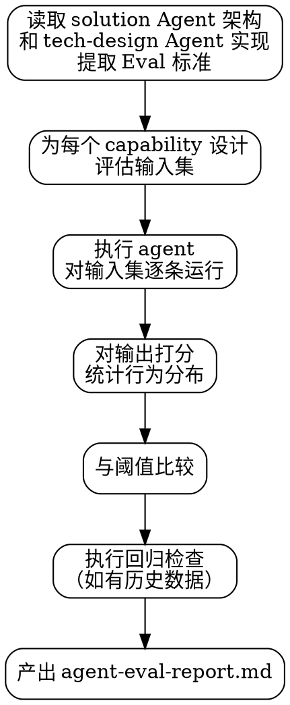

# Agent Eval — Agent 行为分布验证

## 铁律

- **不只测 happy path**：eval 必须包含正常路径、边界场景、对抗场景
- **验证分布，不是验证单次输出**：多次执行同类输入，统计通过率
- **阈值必须量化**：不接受"表现良好"，必须有具体数字

## 概述

Agent Eval 技能验证 Agent 的**默认行为分布**是否符合 solution.md `## Agent 架构` 和 tech-design.md `## Agent 实现` 中定义的 Eval 标准。

**什么是"行为分布"**：
- Agent 在一类任务上正确处理的比例
- Agent 在边界场景中遵守边界的比例
- Agent 在对抗场景中拒绝越权操作的比例

只看单次输出无法判断能力是否稳定成立。

## 何时使用

- `agent_engineering.require_agent_eval: true`
- `harness-runtime/harness/stages/<mission-id>/tech-design.md` 存在 `## Agent 实现` 段落，且该段落定义了 eval 测试设计
- Agent 组件实现已完成（代码已写好）
- 在 `verify` 技能的标准验证完成后

## 何时不使用

- 项目显式关闭 `agent_engineering.enabled`
- 任务无 Agent 组件
- tech-design.md 缺少 `## Agent 实现` 段落（这不是跳过条件，而是设计阻塞，应返回设计补齐）
- Agent 组件实现尚未完成

## 核心流程

## 集成

| 被谁触发 | 触发时机 | 产出 |
|---------|---------|------|
| `verify/workflow.md` | 标准验证完成后 | `harness-runtime/harness/stages/<id>/agent-eval-report.md` |

| 调用谁 | 用途 |
|--------|------|
| 被评估的 Agent | 执行评估输入集 |
