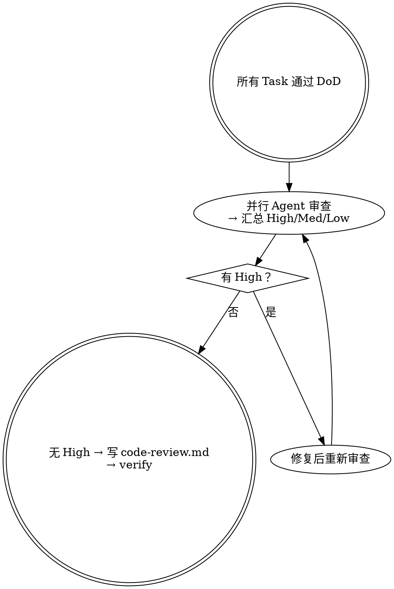

# 代码评审 — 代码评审

## 铁律

```
没有评审通过，不进入交付。
评审发现问题，必须修复后重新评审。
```

## 概述

按变更特征并行唤起审查员；`correctness-reviewer` 与 `tdd-reviewer` 默认必启，`security-reviewer` / `architecture-reviewer` / `data-migration-reviewer` / `e2e-reviewer` / `agent-behavior-reviewer` 按需启用（见 `workflow.md`）。在唤起 `tdd-reviewer` 前先运行 TDD Toolchain 控制面（resolver / runner / normalizer）生成 `toolchain-status.json`；工具链缺口由 Harness 处理，专家只判断测试本身是否能发现错误实现。**审查-修复循环**直至汇总无 High：修复后须重新唤起 Agent 确认，不能改完即止。

## 阶段能力

code-review 对应 RUP 构建阶段后段的实现质量审查和变更集确认。它要证明：实现忠实于验收场景 / 条件、系统责任、方案路线、技术设计和执行授权；测试证据能发现错误实现；High finding 已修复或被显式接受；剩余风险能被验证阶段继续消费。

## 何时使用

- 所有任务项通过 DoD
- 用户说"做代码审查"、"审查一下"
- 准备提 PR 之前

## 何时不使用

- 任务项还未全部完成（→ 继续执行）
- 只是想看某个函数的逻辑（→ 不需要技能，直接看）

## 评审流程



<HARD-GATE>
存在 High 或未解决的 Blocked（根本偏离）时，不得标为评审通过或进入交付。
</HARD-GATE>

## 反合理化

| 想法 | 现实 |
|------|------|
| "测试都通过了，不需要审查" | 测试验证行为，审查验证意图和质量 |
| "这次改动很小" | 小改动也可能引入架构问题 |
| "只是重构，逻辑没变" | 重构最容易引入微妙缺陷 |
| "赶时间，先交付再说" | 赶时间 + 跳审查 = 技术债 |

## 评审维度速查

| 维度 | Checkpoint |
|------|--------|
| 正确性 | 是否满足验收场景 / 条件 / 差量规格的用户可观察行为？是否多做或破坏既有行为？ |
| TDD 有效性 | 测试是否追溯到验收场景 / 条件？Red/Green 是否有效？断言是否足够强？关键风险是否有 fault detection？ |
| 架构 | 是否符合 solution / tech-design 的模块边界、依赖方向、接口契约、数据流和禁止路径？ |
| 安全 | 是否存在可利用攻击路径、越权、注入、泄露、加密/session/webhook/config 风险？ |
| 数据迁移 | schema / DDL / backfill / data repair 是否具备 dry-run、invariant、rollback/recovery 和兼容性证据？ |
| E2E 有效性 | E2E 是否能证明真实用户路径、用户可观察结果、数据现实性和跨层集成边界？ |
| Agent 行为 | Agent 工作权、边界权、责任权是否落到 prompt、tool、policy/hook、runtime guard 和 eval？ |

## Stage Element Model

本阶段必须维护的关键要素见 `.harness/docs/methodologies/stage-element-model.md#code-review`。摘要：

| Element | Used By | Failure If Missing |
|---|---|---|
| Finding | Execute fix loop | 审查变成泛泛建议 |
| Severity | Stage Gate | 阻断项被放行 |
| Role Boundary | Review summary | 审查职责重叠或遗漏 |
| Evidence | Fix / Audit | finding 不可验证 |
| Resolution Ref | Verify / Delivery | 问题状态不闭环 |

按 `workflow.md` 执行详细步骤。
#!/usr/bin/env python3
"""Resolve Harness TDD toolchain obligations into concrete tool actions."""

from __future__ import annotations

import argparse
import json
import sys
from pathlib import Path
from typing import Any

try:
    import yaml
except ImportError:  # pragma: no cover
    yaml = None

SCRIPT_DIR = Path(__file__).resolve().parent
if str(SCRIPT_DIR) not in sys.path:
    sys.path.insert(0, str(SCRIPT_DIR))

from toolchain_probe import (  # noqa: E402
    build_probe,
    find_latest_mission,
    load_json,
    read_text,
)
from test_obligation_policy import normalize_obligation  # noqa: E402


CAPABILITY_TOOL_PREFERENCES = {
    "test_result": ["pytest", "vitest/jest"],
    "coverage": ["coverage.py/pytest-cov", "vitest/jest"],
    "diff_coverage": ["diff-cover"],
    "mutation_or_fault_injection": ["mutmut", "StrykerJS"],
    "ui_component_or_e2e": ["vitest/jest", "playwright"],
    "e2e_ui": ["playwright"],
    "a11y": ["playwright"],
    "api_contract": ["schemathesis"],
    "regression_report": ["pytest", "vitest/jest", "playwright"],
}

TOOL_INSTALL = {
    "pytest": {"ecosystem": "python", "packages": ["pytest", "pytest-json-report"]},
    "coverage.py/pytest-cov": {"ecosystem": "python", "packages": ["coverage", "pytest-cov"]},
    "diff-cover": {"ecosystem": "python", "packages": ["diff-cover"]},
    "mutmut": {"ecosystem": "python", "packages": ["mutmut"]},
    "vitest/jest": {
        "ecosystem": "typescript",
        "packages": ["vitest", "@vitest/coverage-v8", "@testing-library/react", "@testing-library/jest-dom", "jsdom"],
    },
    "playwright": {"ecosystem": "typescript", "packages": ["@playwright/test"]},
    "StrykerJS": {"ecosystem": "typescript", "packages": ["@stryker-mutator/core"]},
    "schemathesis": {"ecosystem": "python", "packages": ["schemathesis"]},
}


def load_yaml(path: Path) -> dict[str, Any]:
    if yaml is None or not path.exists():
        return {}
    data = yaml.safe_load(path.read_text(encoding="utf-8")) or {}
    return data if isinstance(data, dict) else {}


def extract_contract(path: Path) -> dict[str, Any]:
    if yaml is None:
        return {}
    if path.exists():
        parsed = yaml.safe_load(path.read_text(encoding="utf-8")) or {}
        contract = parsed.get("control_contract")
        return contract if isinstance(contract, dict) else {}
    return {}


def package_manager(root: Path) -> str:
    if (root / "pnpm-lock.yaml").exists():
        return "pnpm"
    if (root / "yarn.lock").exists():
        return "yarn"
    if (root / "package-lock.json").exists():
        return "npm"
    return "npm"


def install_command(root: Path, tool: str, packages: list[str]) -> str:
    info = TOOL_INSTALL.get(tool, {})
    ecosystem = info.get("ecosystem")
    if ecosystem == "python":
        return "python3 -m pip install --upgrade " + " ".join(packages)
    manager = package_manager(root)
    if manager == "pnpm":
        return "pnpm add -D " + " ".join(packages)
    if manager == "yarn":
        return "yarn add -D " + " ".join(packages)
    return "npm install -D " + " ".join(packages)


def approved_packages(policy: dict[str, Any]) -> set[str]:
    approved: set[str] = set()
    for values in ((policy.get("approved_tools") or {}).values()):
        if isinstance(values, list):
            approved.update(str(item) for item in values)
    return approved


def resolve(root: Path, mission_id: str | None) -> dict[str, Any]:
    mission_id = find_latest_mission(root, mission_id)
    config = load_yaml(root / "harness-runtime/config/harness.yaml")
    policy = config.get("test_toolchain") if isinstance(config.get("test_toolchain"), dict) else {}
    install_policy = policy.get("install_policy", "auto_for_required_whitelist")
    probe = build_probe(root, mission_id)
    toolchain = probe.get("toolchain") or []
    tool_by_name = {tool.get("tool"): tool for tool in toolchain if isinstance(tool, dict)}

    stage_root = root / "harness-runtime/harness/stages" / str(mission_id)
    contract = extract_contract(stage_root / "contracts" / "execution-brief.contract.yaml")
    tasks = contract.get("tasks") or []

    approved = approved_packages(policy)
    task_plans: list[dict[str, Any]] = []
    install_actions: list[dict[str, Any]] = []
    decision_gate_reasons: list[dict[str, Any]] = []

    for task in tasks:
        if not isinstance(task, dict):
            continue
        obligation = normalize_obligation(task, policy)
        obligation_source = obligation.pop("_harness_source")
        inferred_fields = obligation.pop("_harness_inferred_fields")
        required = list(dict.fromkeys(obligation.get("required_capabilities") or []))
        capability_map: dict[str, Any] = {}
        for capability in required:
            candidates = CAPABILITY_TOOL_PREFERENCES.get(capability, [])
            selected = next((tool for tool in candidates if (tool_by_name.get(tool) or {}).get("configured")), None)
            selected = selected or (candidates[0] if candidates else None)
            selected_tool = tool_by_name.get(selected) if selected else None
            missing = bool(selected and not (selected_tool or {}).get("configured"))
            capability_map[capability] = {
                "candidate_tools": candidates,
                "selected_tool": selected,
                "configured": bool((selected_tool or {}).get("configured")),
                "available": bool((selected_tool or {}).get("available")),
                "missing": missing,
            }
            if selected and missing:
                install_info = TOOL_INSTALL.get(selected, {})
                packages = install_info.get("packages") or []
                unapproved = [pkg for pkg in packages if pkg not in approved and selected not in approved]
                if unapproved:
                    decision_gate_reasons.append({
                        "task_id": task.get("id"),
                        "capability": capability,
                        "reason": "non_whitelisted_tool",
                        "tool": selected,
                        "packages": packages,
                    })
                elif install_policy == "auto_for_required_whitelist":
                    install_actions.append({
                        "task_id": task.get("id"),
                        "capability": capability,
                        "tool": selected,
                        "packages": packages,
                        "command": install_command(root, selected, packages),
                    })
        task_plans.append({
            "task_id": task.get("id"),
            "obligation_source": obligation_source,
            "inferred_fields": inferred_fields,
            "missing_obligation": False,
            "risk_level": obligation.get("risk_level"),
            "surfaces": obligation.get("surfaces") or [],
            "required_capabilities": required,
            "evidence_required": obligation.get("evidence_required") or [],
            "accepted_alternatives": obligation.get("accepted_alternatives") or {},
            "capabilities": capability_map,
        })

    status = "BLOCKED" if decision_gate_reasons else "WARN" if install_actions else "PASS"
    return {
        "schema_version": 1,
        "mission_id": mission_id,
        "status": status,
        "install_policy": install_policy,
        "probe_status": probe.get("status"),
        "toolchain": toolchain,
        "tasks": task_plans,
        "install_actions": install_actions,
        "decision_gate_reasons": decision_gate_reasons,
        "probe": probe,
    }


def main() -> int:
    parser = argparse.ArgumentParser()
    parser.add_argument("--root", default=".")
    parser.add_argument("--mission-id")
    parser.add_argument("--output")
    parser.add_argument("--json", action="store_true")
    args = parser.parse_args()

    root = Path(args.root).resolve()
    result = resolve(root, args.mission_id)
    if args.output:
        output = Path(args.output)
        output.parent.mkdir(parents=True, exist_ok=True)
        output.write_text(json.dumps(result, ensure_ascii=False, indent=2), encoding="utf-8")
    if args.json or not args.output:
        print(json.dumps(result, ensure_ascii=False, indent=2))
    return 0


if __name__ == "__main__":
    raise SystemExit(main())
