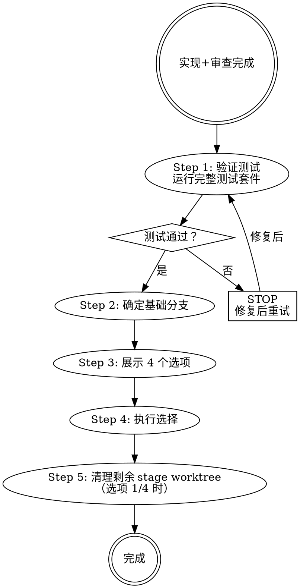

# 分支收尾 — 分支收尾实现

## 概述

`git-workflow close` 操作的实现层。通过提供清晰的选项和执行所选工作流来引导任务分支的收尾。

finishing-branch 对应 RUP 配置与变更管理中的版本控制、分支管理和变更集集成。它只处理交付后的 Git / PR / worktree 收尾，不参与需求语义加工，不改变 delivered 结论，也不重新定义交付范围。

**调用方**：`git-workflow` 的 `close` 操作（不直接由自治循环调度）。

**核心原则**：验证测试 → 确认无 active stage worktree → 展示选项 → 执行选择 → 清理剩余 stage worktree。

## 阶段能力

分支收尾必须回答：已交付变更是否具备安全合并、推送、保留或丢弃的条件。

它需要确认 delivery 已完成、测试回归通过、没有 active / BLOCKED stage worktree、分支状态清晰、用户已选择收尾策略，并把实际 Git 操作和最终状态归档。发现交付证据不足时返回 delivery / verify；发现测试失败或 worktree 未闭合时停止收尾。

## 何时触发

- delivery 完成后，自治循环或用户触发 `git-workflow close`
- `git-workflow close` 委托给本技能执行具体收尾逻辑
- 用户说"分支怎么处理"、"合并代码"、"收尾"时也经由此路径

## 何时不触发

- 还有任务项未完成（→ 继续执行）
- 还未通过 code-review（→ 先审查）

## 流程

## 4 个选项

| # | 选项 | 操作 | 清理 |
|---|------|------|--------------|
| 1 | 在本地合并回 base-branch | 合并 mission branch + 验证 + 删 mission branch | 清理已完成 stage worktree |
| 2 | 推送并创建 PR | push mission branch + gh pr create | 保留 mission branch |
| 3 | 保持现状 | 报告 mission branch 和剩余 stage worktree | 保留 |
| 4 | 丢弃工作 | 确认后强制删除 mission branch 和 stage worktree | 清理 |

## 红线

<HARD-GATE>
收尾操作不可违反的硬约束：
- 测试必须通过才能继续；测试失败时立即 STOP，修复后重试
- 合并前必须已验证测试结果，不可跳过
- 不得在存在 active / BLOCKED stage worktree 时合并 mission branch；必须先处理阶段工作
- 选项 4（丢弃工作）必须用户输入 `discard` 明确确认，否则不得执行
- 未经用户请求不得强制推送（`--force`）
</HARD-GATE>

> **各选项的具体执行命令、worktree 清理步骤见 `workflow.md`。**

## 集成

| 技能 | 关系 |
|-------|------|
| `git-workflow` | 关闭 mission branch，并清理已完成或被丢弃的 stage worktree |
| `execute` | 执行类 lane action 完成后，由 Stage Gate 写回 Work Graph；当相关 node / Mission Slice 终止后，自治循环触发 git-workflow close |
| `delivery` | close 在用户验收与内部归档完成后触发；是否需要 retrospective 由当前 Mission Slice / 用户决策决定 |

按 `workflow.md` 执行详细步骤。
