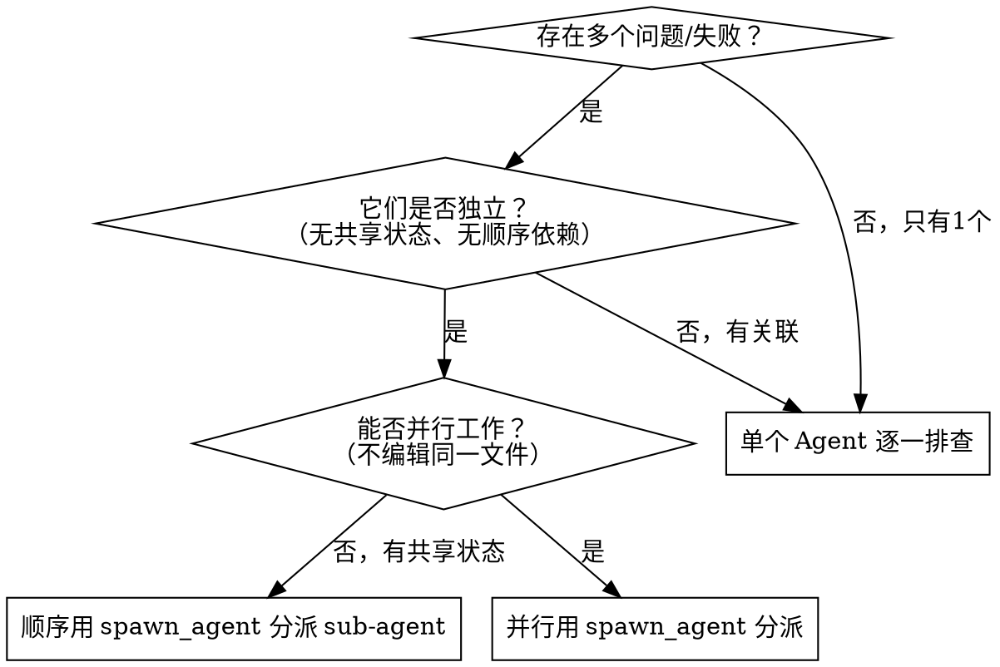
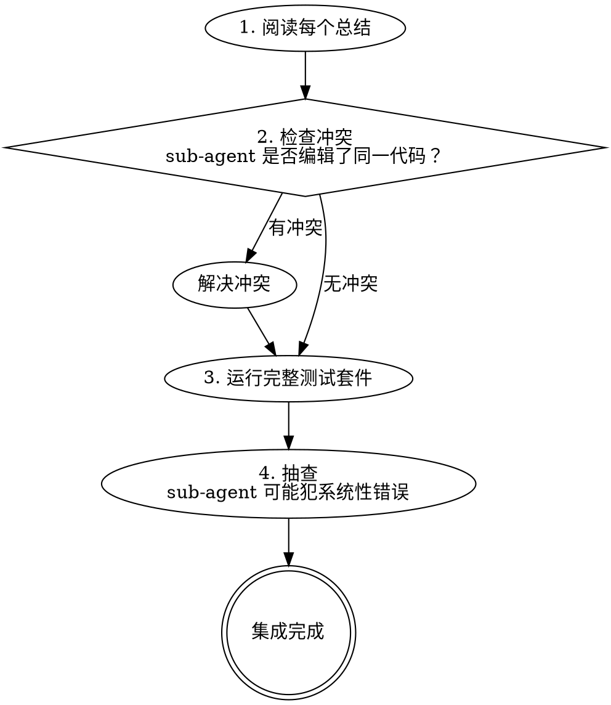

# Parallel Agent — 并行用 `spawn_agent` 分派 sub-agent

## 概述

将多个独立问题用 `spawn_agent` 分派给各自专注的 sub-agent 并行处理，而非逐个排查浪费时间。

**核心原则**：每个独立问题域一次 `spawn_agent` 调用，让它们并发工作。

## 何时使用



**适用场景：**
- 3+ 测试文件因不同根因失败
- 多个子系统独立故障
- 多个不相关缺陷需要同时修复
- 大规模重构后多处独立出错

**不适用场景：**
- 失败有关联（修一个可能修好其他的）→ 先一起排查
- 需要理解完整系统状态 → 单 Agent 处理
- sub-agent 会编辑同一文件 → 会冲突
- 探索性调试（还不知道什么坏了）→ 先用 systematic-debugging

## sub-agent 提示词结构

每个 sub-agent 必须获得 4 个要素：

| 要素 | 说明 | 反模式 |
|------|------|--------|
| **明确范围** | 一个测试文件或一个子系统 | "修复所有测试" |
| **完整上下文** | 错误信息、测试名称、相关代码 | "修复竞态条件" |
| **约束条件** | 不修改哪些代码 | 无约束（sub-agent 可能重构一切） |
| **输出要求** | 返回什么格式的总结 | "修好它" |

### 提示词示例

```markdown
修复 src/auth/login.test.ts 中 2 个失败的测试：

1. "should reject expired tokens" - 期望 401 但得到 200
2. "should refresh token before expiry" - 超时

相关文件：src/auth/token-service.ts, src/auth/middleware.ts

约束：不要修改 src/auth/config.ts 或其他测试文件。

返回：你发现了什么根因以及修复了什么的总结。
```

## 执行流程

### 1. 识别独立问题域

按故障分组，确认每组之间**无共享状态**：

```
文件 A 测试：认证流程（3 个失败）
文件 B 测试：支付处理（2 个失败）
文件 C 测试：通知系统（1 个失败）
→ 三个独立域，可并行
```

### 2. 构造并用 `spawn_agent` 分派

```
spawn_agent(message: "修复 auth 测试：[具体错误+上下文+约束+输出要求]")
spawn_agent(message: "修复 payment 测试：[具体错误+上下文+约束+输出要求]")
spawn_agent(message: "修复 notification 测试：[具体错误+上下文+约束+输出要求]")
// 三个 spawn_agent 任务并发运行
```

### 3. 审查与集成

sub-agent 返回后：



<HARD-GATE>
sub-agent 返回后必须运行完整测试套件验证。不能只信任 sub-agent 的报告。
</HARD-GATE>

## 常见错误

| 错误 | 问题 | 修复 |
|------|------|------|
| 范围太宽 | "修复所有测试" → sub-agent 迷失 | 一个问题域一个 sub-agent |
| 无上下文 | "修复竞态条件" → sub-agent 不知道在哪 | 粘贴错误信息和测试名 |
| 无约束 | sub-agent 重构了不该动的代码 | 明确"不要修改 X" |
| 输出要求模糊 | 不知道改了什么 | 要求返回根因+修改总结 |
| 关联问题并行 | 修复互相冲突 | 先判断独立性 |
| 信任 sub-agent 报告 | sub-agent 可能报告成功但实际有问题 | 独立运行完整测试套件 |

## 红线

**绝不：**
- 对有关联的失败并行用 `spawn_agent` 分派
- 让 sub-agent 编辑同一文件
- 跳过返回后的完整测试验证
- 信任 sub-agent 的成功报告

**始终：**
- 先判断独立性再决定并行
- 每个 sub-agent 给出明确范围+上下文+约束+输出要求
- 返回后运行完整测试套件
- 抽查 sub-agent 的修改

## 集成

| 技能 | 关系 |
|-------|------|
| `execute` | SDD 模式中遇到多个独立失败时可切换到并行用 `spawn_agent` 分派 |
| `systematic-debugging` | 单个问题用 debugging，多个独立问题用 `spawn_agent` 并行分派 |
| `verification-before-completion` | 集成后必须验证 |

Follow the instructions in this SKILL.md directly. No separate workflow.md needed.
