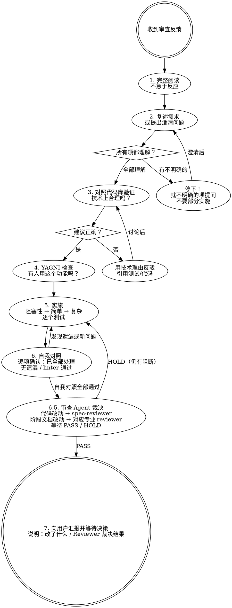

# Receiving 审查 — 接收代码审查

## 铁律

```
先验证再实施。先提问再假设。技术正确性优先于社交舒适度。
```

## 概述

处理收到的代码审查反馈。与 `code-review`（发起审查）互补。

## 何时使用

- 收到人类或 sub-agent 的代码审查反馈
- 收到 PR 上的审查 comments
- 用户说"按这些意见改"、"修这几项"
- 你想直接说"好的马上改"——停下，先验证

## 响应流程



## 禁止的回应

| 禁止 | 替代 |
|------|------|
| "你说得太对了！" | 复述技术需求，或直接动手修 |
| "好观点！" / "反馈很棒！" | 直接说明修复内容 |
| "让我立刻实施" | 先验证再实施 |
| "感谢你发现了这个！" | 行动说明一切，直接修复 |

**正确的确认方式：**
```
✅ "已修复。[简要说明改了什么]"
✅ "发现得好——[具体问题]。已在 [位置] 修复。"
✅ [直接修复，代码本身就是最好的回应]
```

## 处理不明确的反馈

```
收到 6 项反馈，理解 1、2、3、6，对 4、5 不确定。

❌ 先实施 1、2、3、6，稍后再问 4、5
 → 各项之间可能有关联，部分理解 = 错误实施

✅ "第 1、2、3、6 项我理解了。第 4 和第 5 项需要澄清后再动手。"
 → 先全部澄清，再全部实施
```

<HARD-GATE>
有任何一项不明确 → 先不要实施任何内容。就不明确的项提问。
</HARD-GATE>

## YAGNI 检查

审查者建议"正规化"某个功能时：

```bash
# 在代码库中搜索实际使用情况
rg "functionName" --type ts
```

- **没人用** → "这个接口没有被调用。删掉它（YAGNI）？"
- **有人用** → 按建议正规实现

## 何时反驳

在以下情况反驳：
- 建议会破坏现有功能
- 审查者缺少完整上下文
- 违反 YAGNI
- 对当前技术栈来说技术上不正确
- 与之前的架构决策冲突

**如何反驳（结构化，不是聊天里说一句）：**
- 用技术理由，不带防御情绪
- 引用可正常工作的测试/代码
- 提出具体问题
- **当反驳的是阶段 reviewer 的阻断性 gap 时，记结构化 dispute**（写入 contract `effectiveness_review.disputes`：`{gap_id, role, worker_rebuttal, evidence_refs[], round, status: open}`），走 `autonomy-loop.md`「有界反驳-仲裁通道」：必须带证据引用，上限 2 轮；每轮跑 `harness contract check-disputes --artifact <contract>` 判断是否到顶，命中即升级 Decision Gate 由用户仲裁。空口反驳（无 `evidence_refs`）无效，转回修复循环。

**反驳错了怎么办：**
```
✅ "你是对的——我检查了 [X]，确实 [Y]。正在实施。"
❌ 长篇道歉 / 为反驳辩护 / 过度解释
```

## 实施顺序

对于多项反馈，按以下顺序：

1. **阻塞性问题**（崩溃、安全）
2. **简单修复**（拼写、导入、格式）
3. **复杂修复**（重构、逻辑变更）

每项修复后：
- 运行相关测试
- 验证无回归
- 再做下一项

**所有项实施完成后，必须执行两阶段闭环（步骤 6 + 6.5）：**

**步骤 6 — 自我对照（必要条件，不充分）：**
- 对照原始反馈列表，逐项确认是否已修复
- 若存在 `harness-runtime/harness/stages/<mission-id>/code-review.md`，读取审查证据契约的 `findings[*].id`，按 `FND-NNN` 跟踪修复状态；修复后将 status 改为 `fixed` 并补 `resolution_ref`
- 检查有无遗漏项
- 检查有无引入新问题或回归
- 使用 `ReadLints` 检查 linter 错误

**步骤 6.5 — 审查 Agent 裁决（充分条件）：**
- 代码修改 → 唤起 `spec-reviewer`，传入：变更文件列表 + 原始反馈列表 + 修复说明
- 阶段文档修改 → 唤起本次工作对应 `professional_roles.stage_policies` / `work_graph.lanes` 中声明的专业 reviewer；若本次工作没有 reviewer，则依赖 Stage Gate 与后续工作消费发现问题
- 等待审查员返回裁决：
 - PASS（无阻断）→ 步骤 7，向用户汇报结果
 - HOLD（仍有阻断）→ 回到步骤 5 继续修复（无轮次放行，轮次只记录修复历史、永不放行，每轮等同严格度重审）；卡死（修复后仍以相同根因连续 HOLD 无实质进展）→ Decision Gate，候选不含"接受遗留 / 降级通过"

<HARD-GATE>
自我对照通过 ≠ 完成。必须经过审查 Agent 裁决 PASS，才能进入"等待用户决策"状态。
执行者不能自证通过。
</HARD-GATE>

## 区分反馈来源

| 来源 | 信任度 | 处理方式 |
|------|--------|---------|
| 用户/搭档 | 高 | 理解后直接实施，范围不清时才问 |
| sub-agent 审查 | 中 | 对照代码验证后实施 |
| 外部审查者 | 需验证 | 检查是否会破坏现有功能、是否了解上下文 |

## 常见错误

| 错误 | 修正 |
|------|------|
| 敷衍附和 | 复述需求或直接行动 |
| 盲目实施 | 先对照代码库验证 |
| 批量实施不测试 | 一次一项，逐个测试 |
| 假设审查者一定对 | 检查是否会破坏现有功能 |
| 回避反驳 | 技术正确性 > 社交舒适度 |
| 部分理解就开始 | 先澄清所有项 |

## 集成

| 技能 | 关系 |
|-------|------|
| `code-review` | code-review 发起审查，receiving-review处理反馈 |
| `verification-before-completion` | 实施修复后验证 |
| `execute` | 在执行期间收到反馈时调用 |

Follow the instructions in this SKILL.md directly. No separate workflow.md needed.
