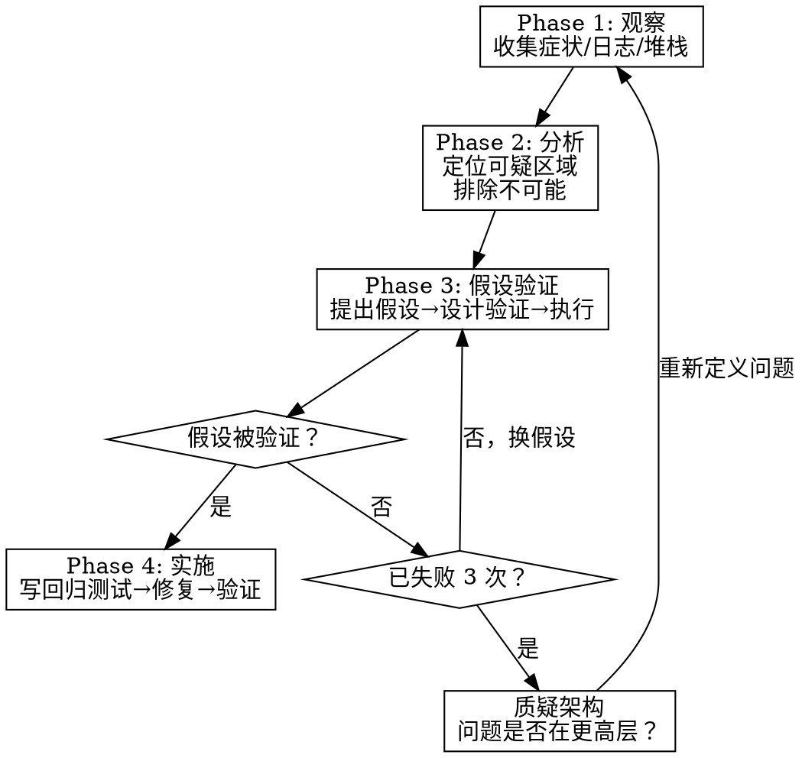

# Systematic Debugging — 系统化调试

## 铁律

```
不理解根因，不写修复代码。
```

## 概述

4 阶段调试法：观察 → 分析 → 假设验证 → 实施。拒绝"改了试试"的冲动。

在缺陷闭环中，`bug-fix` 是主入口；`systematic-debugging` 只负责产出 direct cause、deep cause、Harness 缺口和 blast radius。补丁、回归证据和记忆决策由 `bug-fix` 继续编排。

## 何时使用

- `bug-fix` / `execute` 需要根因分析 carrier
- 测试、构建或编译失败且原因不明，但尚不能判断为产品行为缺陷
- 性能、时序、flaky、环境或集成问题需要系统化定位
- 用户明确要求先查原因、定位根因、不要改代码或暂不修复
- 执行中连续 3 次非缺陷类失败，或 bug-fix 根因分析连续失败

## 何时不使用

- 错误信息已明确指出问题（如 typo、import 缺失）→ 直接修
- 用户报告 expected vs actual 偏差：结果不对、内容缺失、样式丢失、行为回归、线上异常、crash、AC 输出不符 → 先走 `bug-fix`
- 不是缺陷而是新需求 → 走任务接入

## 典型表达

| 用户表达 | 路由原因 |
|----------|----------|
| "先帮我查为什么 CI 偶发失败，先别改代码" | 目标是根因诊断，不是缺陷闭环 |
| "某个后台任务偶发卡住，先定位卡在哪个环节" | 时序/运行态诊断，先收集证据 |
| "构建失败但错误链很长，看下根因" | 构建失败根因未知，先系统化调试 |

## 4 阶段流程



## 3 次法则

**连续 3 次假设验证失败 → 停下来质疑架构。**

问自己：
- 我是在正确的层面调试吗？
- 问题的根因是否在我正在看的代码之外？
- 是否需要质疑需求本身？

## Blast radius 取证

本技能声明的四项产出里，`blast radius`（根因影响面）不是凭印象写一句"影响不大"，必须从根因符号出发导出可核验的扩散面。根因确认后（Phase 3 假设被验证），对根因函数 / 符号执行以下取证：

1. **跑 graphify-impact**：对根因符号执行 graphify blast-radius（依赖影响能力已建立），取其调用方 / 被调用方扩散图。
2. **按调用深度分级**：
   - `d=1`：直接调用根因符号的函数 / 直接读写其状态的位置——回归必覆盖。
   - `d=2`：经一跳间接依赖根因符号的位置——回归应覆盖，至少抽样。
   - `d=3`：经两跳间接关联、或同模块共享状态的位置——记录为观察面，按风险决定是否覆盖。
3. **附证据来源**：每条扩散项标来源（`graphify_impact` 调用边 / 手动 Grep 调用方搜索），不写无来源的"可能影响"。
4. **工具不可用降级**：graphify-impact 不可用 / 未索引 / 过期时，记降级原因，回退到对根因符号名做 Grep 调用方搜索作为临时证据，并标注该 blast radius 为降级取证、深度分级置信度下降。

产出模板：

| 扩散项（符号 / 文件） | 调用深度 | 与根因的关系 | 证据来源 |
|---|---|---|---|
| `<symbol/file>` | d=1 / 2 / 3 | 直接调用 / 间接依赖 / 共享状态 | graphify_impact / Grep |

该 blast radius 由 `bug-fix` 消费：`bug-fix` 据此决定回归测试覆盖范围（d=1 必覆盖，d=2 抽样，d=3 按风险）。blast radius 缺失或全部 INFERRED 而无取证时，`bug-fix` 不得据此收敛回归范围。

## 反合理化

| 想法 | 现实 |
|------|------|
| "改一行试试" | 盲改 = 赌博。先理解根因。 |
| "我觉得是这里的问题" | 感觉 ≠ 证据。验证它。 |
| "先修了再说" | 不理解根因的修复 = 新缺陷的种子 |
| "没时间调试了" | 没时间调试 = 有时间返工？ |
| "日志太多了不想看" | 日志是证据。证据 > 直觉。 |
| "这个错误很常见，应该是 X" | "应该"是禁用词。验证它。 |

## 防御性调试原则

- **Defense in Depth**：不信任任何单一信号，交叉验证
- **Condition-Based Waiting**：异步问题用条件等待而非固定延时
- **Minimal Reproduction**：先缩小问题范围再修复

## 集成

| 技能 | 关系 |
|-------|------|
| `bug-fix` | 缺陷闭环的主入口；本技能作为根因分析 carrier |
| `execute` | 连续 3 次非缺陷类失败，或 bug-fix 需要根因分析时触发本技能 |
| `verify` | 修复后用验证确认无回归 |
| `trace-log` | 调试过程记录到执行日志 |

按 `workflow.md` 执行详细步骤。
