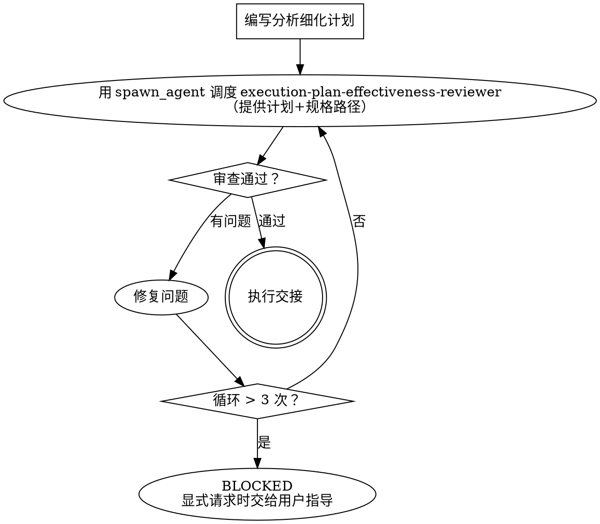

# Writing Plans — 分析细化实现计划

> **TDD 计划契约**：`.harness/docs/tdd-planning-contract.md`

## 概述

`writing-plans` 的职责是提供计划细化方法：把 Parent task 继续分析、覆盖、拆分为 Atomic Tasks（原子任务），并保证 Atomic Tasks 内嵌在对应 Parent task 的 `atomic_task_queue:` 下，不存在独立于 Parent task 的全局队列。它不产出可提交源码，不替代 execute 阶段实现。

与 `breakdown` 的关系：
- `breakdown` 是唯一负责首次产出 `execution-brief.md` 的阶段，并且首次写盘就必须包含 Parent task + parent-local `atomic_task_queue`。
- `writing-plans` 只能作为 breakdown 内部的原子任务规划子流程，先在内存 planning packet 中补足队列，再由 breakdown 一次性写入完整 `execution-brief.md`。
- 用户明确要求手动重规划时，`writing-plans` 可以修复已有 `execution-brief.md`，但修复后必须回到 breakdown Stage Gate 重新审查和同步 Work Graph。

与 `execute` 的区别：
- `writing-plans` 消除执行歧义，拆分任务边界。
- `execute` 读取计划和代码库，完成真实代码、测试、提交和审查。

## 调用边界

`writing-plans` 不是 breakdown → execute 之间的自动补强步骤。自治循环不得在 breakdown 产出 Parent task 骨架后再把它作为常规下一阶段调用。

execute 始终只遍历 `Execution Units`：Parent task 提供顺序、完成边界、DoD、规格引用和证据权威；真实执行单位是该 Parent task 内的 `atomic_task_queue.execution_units[]`。execute 不得绕过 parent-local atomic_task_queue 直接实现 Parent task。

允许调用条件：
- breakdown 主流程在首次写 `execution-brief.md` 前，需要用本方法细化 Parent task 的 Atomic Task Queue。
- `execution-plan-effectiveness-reviewer` HOLD，指出已写入的 `execution-brief.md` 中某个 Parent task 的 `atomic_task_queue` 缺失、不完整或与父边界冲突。
- `execute` 前置检查发现 TASK node 绑定的 parent-local `atomic_task_queue` 损坏、过期或与 Stage Gate 产物不一致，此时必须 BLOCKED 并回到 breakdown / 计划修复，修复后重新 Stage Gate。
- 用户明确要求"重规划""细化 Atomic Tasks""修复 execution-brief 的 atomic_task_queue"。

breakdown 内部调用时，输出必须先进入 breakdown planning packet，不能先写一个缺队列的 `execution-brief.md` 再补。手动修复已有文件时，Atomic Tasks 必须保存到 `harness-runtime/harness/artifacts/<mission-id>/breakdown/execution-brief.md` 的 `## Execution Units` 中，并同时填充对应 Parent task 下的 `atomic_task_queue:` 结构块与每个 Atomic Task 的正文块。计划通过审查和 Stage Gate 前，execute 不得开始。

## 何时使用

- 已有 execution-brief，需要将任务项转化为 Atomic Tasks（原子任务）
- execution-brief 的某个任务项仍可拆成多个独立行动，例如 schema、domain service、API route、projector、UI、测试、迁移验证、回归证据
- execution-brief 的任务项缺少明确输入输出、涉及文件、接口/数据契约、测试数据准备、execute-time validation commands、事务/状态边界、停止条件或证据要求
- breakdown 主流程需要在首次写 execution-brief 前完成 Atomic Task Queue 规划
- execute 发现 parent-local atomic_task_queue 缺失、过期或未覆盖当前 Parent task，需要 BLOCKED 后回到 breakdown / 手动计划修复
- 计划将交给 sub-agent 执行（SDD 模式）

## 何时不使用

- 还没有需求/设计文档 → 先走探索/prd/设计
- 还没有 execution-brief → 先走 breakdown
- breakdown 已经一次性产出完整 Parent task + atomic_task_queue，且 Stage Gate 已同步到 Work Graph → 直接进入 execute

## 阶段边界

<HARD-GATE>
Execution Units / Atomic Task details 不得包含完整可提交实现，不得包含整份测试文件、完整 class / function / route / component / migration 的正文，不得要求执行者复制粘贴 Markdown 里的代码作为最终实现。
</HARD-GATE>

允许写入：
- 精确文件路径、创建/修改/删除动作、涉及 symbols 或接口名称
- 同项目内代码模式参考（样板间 / 相似实现）：路径、symbol、观察到的实现习惯、应沿用的骨架/风格约束，以及不得复用的业务逻辑边界
- 函数/方法/路由/数据结构的签名摘要
- 事务边界、状态机迁移、权限/guard 顺序、错误分支和幂等约束
- TDD scope：行为边界、Red 失败目标、Green 完成边界、Refactor 限制、禁止覆盖的范围、断言清单、测试数据边界、允许/禁止的 test doubles、fault / mutation 信号
- 测试场景清单、测试数据形状、fixture 名称、seed 数据字段、断言清单
- execute-time validation commands、预期失败/通过信号、证据文件或 trace 要求
- 伪代码式流程，必须短小并只表达顺序或契约，不表达完整实现

禁止写入：
- 完整源码文件正文
- 完整测试文件正文
- 可直接复制运行的业务实现
- 完整 SQL migration 正文
- 完整 API route / React component / service class
- 大段 import + class/function body 的代码块
- 以“先把代码写在文档里，execute 时复制”为目的的内容

如果必须引用现有代码模式，只写“参考路径 + symbol + 需要沿用的骨架/行为约束”，不在计划文档中复制整段实现。

## 代码模式参考（样板间 / 相似实现）

代码模式参考是 writing-plans 的必备分析层。它对应胶水编程里的“样板间”：给 execute 阶段找到最接近的同项目骨架或同类实现，让执行者在真实编码前知道当前项目的文件结构、组件组合、请求封装、测试组织、异常处理和事务习惯。

它的边界是：计划文档只定位和解释代码模式，不内联样板间源码；execute 阶段可以基于真实参考文件复制骨架、改字段、连接口，但必须重新读取真实代码并遵守本任务的规格边界。不得从参考文件搬运业务逻辑、条件分支、数据假设或历史偶然实现。

每个涉及代码变更的 Atomic Task 都必须给出同项目内的代码模式参考，除非代码库中不存在可比对象。不存在时要写明搜索范围和结论，例如“已检查 `apps/backend/app/api/` 和 `apps/backend/tests/`，无同类 route/test 结构”。

代码模式参考必须说明：
- Reference path：参考文件路径
- Reference symbol：参考的类、函数、fixture、route、component、migration 或测试组织
- Pattern type：`showroom`（完整样板间）、`same_surface`（同 surface 相似实现）、`test_pattern`（测试组织）、`migration_pattern`（迁移/回滚模式）、`no_match`（无可比对象）
- Observed convention：从参考中观察到的文件拆分、命名、目录、组件组合、请求封装、异常处理、事务、依赖注入、fixture、断言、提交拆分或 UI 组织习惯
- Apply to this task：本 Atomic Task 应沿用哪些骨架、组合方式或风格约束
- Do not copy：哪些业务逻辑、条件分支、数据假设或实现细节不得复制

### 检索规程（怎么找——这一层是义务，不是可选）

代码模式参考不是"凭印象写一条参考"，而是**对实现代码库执行一次真实检索**后落字段。每个涉及代码变更的 Atomic Task 按下列步骤产出：

1. **定位 artifact 类型与 surface**：先确定本任务要产出的代码物件类型（route / endpoint、service / domain method、repository / 持久化、migration、component / page、hook / store、test、fixture、config）及其作用面（surface）。
2. **定位检索根**：从 `project-context` 的模块地图、或 `harness knowledge resolve --stage breakdown` 返回的 `engineering/patterns` 找到该 surface 在**本项目实现代码库**里的源码根目录；没有地图时用 `Glob` 按目录约定探测真实根目录。
3. **在源码树里真实检索（不是在 artifacts/ 里找）**：
   - 按目录：`Glob` 同 surface 目录下的同类文件；
   - 按符号 / 命名：`Grep` 路由装饰器、service 类后缀、repository 方法、迁移文件模式、测试命名约定；
   - 记录**实际检索过的路径范围与命中数**——这是 `no_match` 时唯一可信的搜索证据。
4. **读真实命中文件再提炼字段**：`Read` 候选文件，`observed convention` 必须是**从代码里读出来的事实**（命名、目录、依赖注入、异常处理、事务、断言风格），不得用 tech-design / solution 里的设计约束（如 "DTO backward compatibility"）冒充。
5. **选最近样板**：`same_surface`（同 surface 相似实现）> `showroom`（完整骨架）> 同层跨 surface > `test_pattern` / `migration_pattern`。多候选取改动形态最接近的一个，实现样板与测试样板可分别各给一条。
6. **确无可比对象才写 `no_match`**：写明实际检索过的目录 / 命名范围 + 命中数=0 的结论（例如"已 Glob `apps/backend/app/api/**` 并 Grep `@router`，无同类 route 结构"）。

**硬约束（这条直接堵住"拿设计文档充样板"的退路）**：`Reference path` 必须指向**实现代码库内的真实源码文件**。**禁止用 `harness-runtime/harness/artifacts/**` 内的阶段产物（tech-design / solution / spec / interaction）充当 `Reference path`，禁止把 `IF-xx` / `MOD-xx` / `DATA-xx` / `VS-xx` 这类技术设计 ID 当作 `Reference symbol`**——这些 ID 属于任务的 `traces_to` 技术追溯槽位，与代码模式参考是两个互不替代的槽。无样板时只能写 `no_match`，不能用文档顶包。

示例：

```markdown
**Code pattern references:**
| 参考文件 | pattern type | symbol | 观察到的项目习惯 | 本任务沿用 | 不复制 |
|----------|--------------|--------|------------------|------------|--------|
| `apps/backend/app/api/trails.py` | same_surface | `router` + `require_project_member` | API route 使用 workspace/project scoped path，先做成员校验，再调用 service | 新 route 保持同样 path 结构、依赖注入和错误响应风格 | 不复用 trails 的业务状态判断 |
| `apps/backend/tests/test_task_queue.py` | test_pattern | `test_session` seed helper | 测试用 SQL seed 构造 workspace/project/user/runtime，再断言 DB 状态 | 新测试沿用 seed 层次和断言风格 | 不复制 task_queue 的 source_type 业务假设 |
```

## 分析细化原则

### 覆盖完整性

计划必须覆盖 execution-brief 的全部任务项、验收场景 / 条件、DoD、Test Obligation 和 evidence_required。不得只覆盖容易实现或最显眼的路径；不得把错误路径、权限边界、并发、幂等、回滚、数据迁移、观测证据或回归要求留给后续随缘补齐。

### TDD 范围细化

每个会改生产代码的 Atomic Task 都必须先按 `.harness/docs/tdd-planning-contract.md` 定义 TDD scope，再允许进入 execute。TDD scope 不是泛泛写“补测试”，而是执行者必须遵守的测试边界：

- Behavior under test：本 Atomic Task 要证明的可观察行为，必须追溯到 Parent task、验收场景或验收条件
- Red scope：先写什么失败测试，失败原因应该指向哪个缺失行为
- Green scope：只允许实现到哪个行为边界，不能借 Green 顺手扩写相邻需求
- Refactor scope：允许清理哪些结构，禁止改变哪些公共行为或契约
- Out of scope：哪些路径、surface、历史问题、性能优化或重构不属于本 Atomic Task
- Required assertions：必须断言的状态、返回值、错误、权限、持久化、事件、UI 或副作用
- Test data boundary：fixture / seed 数据形状、必要前置状态、禁止依赖的外部状态
- Test doubles boundary：哪些 mock/stub/fake 允许使用，哪些必须使用真实集成或 contract
- Fault / mutation signal：怎样证明测试能抓住错误实现；高风险行为必须有 targeted fault injection、mutation、等价证明或明确阻塞
- Commands：Red、Green、Regression 的运行目录、命令和预期信号

Parent task 章节只保留 Parent 级 TDD 边界；上述文件级 TDD scope 必须出现在同文件中该 Parent task 的 `atomic_task_queue` 每个 Atomic Task 中。

### Execute-time Validation Commands

Parent-local atomic_task_queue 中的验证命令不是 writing-plans 阶段要运行的脚本。它们是交给 execute 阶段和 TDD toolchain 的命令契约：

- Red command：execute 先运行，必须看到目标行为缺失导致的失败。
- Green command：实现后运行，必须看到当前 Atomic Task 的目标测试通过。
- Regression command：当前 Atomic Task 完成后运行，证明相关回归仍通过。
- Coverage / mutation / fault command：按 `test_obligation` 和风险等级提供，作为工具链或等价证据候选。

writing-plans 只负责确认命令有运行目录、目标测试选择器、预期信号和证据输出位置；不得在计划阶段运行这些命令，也不得把命令跑不过作为计划质量结论。真正执行和收集证据只发生在 `execute` / `code-review` 的工具链阶段。

### 任务再拆分

execution-brief 的一个任务项可以、也经常应该拆成多个 Atomic Tasks。writing-plans 的主要产出不是“把某个任务写得更长”，而是识别任务内部的独立行动并拆开：

```text
T02 Trail Stage 扩展
  AT-02-1 测试场景与测试数据准备
  AT-02-2 stage registry 文件创建
  AT-02-3 binding 查询服务
  AT-02-4 stage transition 服务
  AT-02-5 并发 / replay parity 验证
```

拆分标准：
- 一个 Atomic Task 只改变一个明确工程对象或验证一个明确行为集合
- 每个 Atomic Task 失败时能定位到单一原因范围
- 每个 Atomic Task 有独立输入、输出、文件清单、验证方式和证据要求
- 跨 surface 的任务必须拆开，例如 DB、backend service、API、frontend、E2E 分别成项
- 仅当两个动作必须在同一事务或同一提交内才能保持一致时，才允许放在同一 Atomic Task，并说明原因

### 输入输出明确

每个 Atomic Task 必须说明：
- Parent task：来自 execution-brief 的任务项编号
- Goal：完成后系统状态或可观察结果
- Scope：包含和不包含的行为
- Files：创建/修改/删除的文件路径和用途
- Code pattern references：同项目样板间 / 相似实现参考，用于骨架、实现习惯和风格对齐，不用于复制业务逻辑
- Inputs：上游文档、现有 symbol、数据前置、配置前置
- Outputs：代码对象、测试对象、数据状态、文档/trace/evidence
- Dependencies：前置 Atomic Tasks 和外部环境
- 验收追溯：覆盖哪些验收条件或规格场景
- Test Obligation：需要哪些测试能力和证据
- TDD Scope：Red / Green / Refactor 的范围、禁止范围、断言、测试数据和有效性证明
- Commands：execute-time validation commands 和预期信号
- Stop conditions：遇到哪些情况必须停止并进入 Decision Gate / bug-fix / course-correction

## 文件结构先行

在定义 Atomic Tasks 前，先列出任务项到文件的映射：

```markdown
## 文件影响矩阵

| Parent task | 文件 | 动作 | 用途 | 覆盖项 |
|-------------|------|------|------|--------|
| T02 | `apps/backend/app/trail/stage_registry.py` | create | 固定阶段 registry | {{acceptance_trace_2}} |
| T02 | `apps/backend/app/trail/trail_stage_service.py` | create | stage transition 事务边界 | {{acceptance_trace_1}}, {{acceptance_trace_2}} |
| T02 | `apps/backend/tests/test_trail_stage.py` | create | stage transition / binding / replay parity 验证 | {{acceptance_trace_1}}, {{acceptance_trace_2}} |
```

## Atomic Task 结构

```markdown
### AT-02-3: StageBindingService 查询服务

**Parent task:** T02 Trail Stage 扩展 + Stage Registry + Binding
**Goal:** 提供按 workspace/project/stage 查询 teammate 绑定的服务，并返回缺失阶段列表。
**Scope:**
- Include: 查询现有 binding、返回 None、返回缺失 stages
- Exclude: API route、UI 配置、自动补齐 binding

**Files:**
| 文件 | 动作 | 用途 |
|------|------|------|
| `apps/backend/app/trail/stage_binding_service.py` | create | binding 查询服务 |
| `apps/backend/tests/test_trail_stage.py` | modify | 增加 binding 查询验证场景 |

**Code pattern references:**
| 参考文件 | pattern type | symbol | 观察到的项目习惯 | 本任务沿用 | 不复制 |
|----------|--------------|--------|------------------|------------|--------|
| `apps/backend/app/teammate_runtime/service.py` | same_surface | service class 方法组织 | service 接收 session，查询方法返回领域对象或 None，不在 service 中处理 HTTP 响应 | session 注入、返回值风格、异常边界 | 不复制 runtime 业务状态判断 |
| `apps/backend/tests/test_teammate_runtime.py` | test_pattern | `test_session` seed helper | 测试先 seed workspace/project/user/runtime，再断言 service 返回值 | seed 层次和断言组织 | 不复制 runtime 专属字段假设 |

**Inputs:**
- Existing model: `app.trail.models.StageTeammateBinding`
- Existing fixture: `test_session`
- Stage list: `elicit/analyze/impact/align/exec`

**Outputs:**
- `StageBindingService.get_binding(ws_id, proj_id, stage) -> UUID | None`
- `StageBindingService.validate_all_bound(ws_id, proj_id) -> list[str]`
- 测试覆盖存在绑定、缺失绑定、部分缺失三个场景

**TDD Scope:**
| 项 | 内容 |
|----|------|
| Behavior under test | workspace/project/stage 维度的 teammate binding 查询和缺失阶段报告 |
| Red scope | 新增 binding service 测试，先断言存在绑定返回 teammate id、缺失绑定返回 None、部分缺失返回缺失 stage 列表；在 service 不存在或未实现时失败 |
| Green scope | 只实现 binding 查询和缺失列表；不新增 API route、不自动补齐 binding、不改变 stage 枚举 |
| Refactor scope | 可提取查询 helper；不得改变现有 runtime service 行为 |
| Out of scope | UI 配置、API route、自动绑定策略、权限策略变更 |
| Required assertions | 返回值、缺失列表顺序或集合、workspace/project 隔离、无匹配时不抛 HTTP 异常 |
| Test data boundary | 使用 `test_session` seed workspace/project/user/stage binding；不得依赖线上 fixture 或当前数据库残留 |
| Test doubles boundary | 不 mock SQL 查询；允许使用现有 test fixture / in-memory transaction |
| Fault / mutation signal | 将 stage 过滤条件移除或 workspace/project 条件错置时，至少一个测试必须失败 |

**Execute-time validation commands:**
- Red: `cd apps/backend && python3 -m pytest tests/test_trail_stage.py -k binding -v`
- Green: 同命令 PASS
- Regression: `cd apps/backend && python3 -m pytest --tb=short -q`

**Evidence:**
- red_report
- green_report
- regression_report

**Stop conditions:**
- 现有 model 名称或表结构与 tech-design 不一致
- 需要改变 stage 枚举或 teammate_profile 关系
```

## 计划文档头部

```markdown
# [功能名称] 实现计划

**目标：** [一句话描述]
**计划性质：** 分析细化计划；不是源码草稿，不作为复制粘贴来源
**范围来源：** `harness-runtime/harness/artifacts/<mission-id>/breakdown/execution-brief.md`
**设计来源：** `harness-runtime/harness/stages/<mission-id>/tech-design.md`
**输出：** Parent task → Atomic Task 覆盖矩阵、执行顺序、execute-time validation commands 和证据要求

---
```

## 计划审查循环

<HARD-GATE>
计划写完后必须经过审查，不能直接交付执行。
</HARD-GATE>



审查项：
- 是否覆盖 execution-brief 的全部任务项、验收场景 / 条件、DoD、Test Obligation 和 evidence_required
- 是否按 `.harness/docs/tdd-planning-contract.md` 先完成 TDD 设计，而不是把测试范围留给 execute 阶段临场解释
- execution-brief 的复合任务是否已拆成多个 Atomic Tasks，而不是只在原任务下追加长说明
- 每个 Atomic Task 是否只有一个明确工程行动或一个明确验证行动
- 每个 Atomic Task 是否包含输入、输出、涉及文件、代码模式参考（样板间 / 相似实现）、接口/数据契约、TDD scope、测试前置、execute-time validation commands、证据要求和停止条件
- 每个会改生产代码的 Atomic Task 是否明确 Red scope、Green scope、Refactor scope、Out of scope、Required assertions、测试数据边界、test doubles 边界和 fault / mutation signal
- 任务依赖是否能支持有序执行和失败定位
- 是否仍存在隐含查找、隐含设计决策、跨多个行为的一步或失败不可定位的步骤
- 是否包含完整实现代码、完整测试文件或可复制粘贴的源码草稿；如有则 HOLD

## 范围检查

如果规格涵盖多个独立子系统，拆分为多个计划章节或多个计划文件。每个计划单元都必须覆盖完整验收范围内的相关行为，而不是只覆盖易实现部分。

## 执行交接

用户显式请求手动重规划时，计划保存后展示交接状态，不提供绕过 Stage Gate 的执行方式选择：

```text
Atomic Task Queue 已完成并保存到 harness-runtime/harness/artifacts/<mission-id>/breakdown/execution-brief.md

下一步：
1. 重新运行 execution-plan-effectiveness-reviewer 审查execution-brief 路径
2. 回到 breakdown Stage Gate
3. Gate advance 将 Parent task + atomic_task_queue 绑定到 TASK node
```

breakdown 内部调用时不得停下来让用户选择，且不得写入缺队列的中间 `execution-brief.md`。计划审查通过后，自治循环必须回到当前 breakdown Stage Gate，让 `harness gate advance` 将 Parent task 和其内嵌 Atomic Tasks 绑定同步到 Work Graph / TASK node；同步完成后才能进入 execute。若审查 HOLD，则修复计划，最多 3 轮后仍 HOLD 才报告 BLOCKED。

交接给 execute 时必须说明：当前执行单位始终是 `Atomic Task Queue` 中的 Atomic Task；Parent task 只作为索引、边界、DoD、规格引用和 evidence 权威。若 `atomic_task_queue:` 结构块缺失、Atomic Task 覆盖缺失、顺序不清或与 Parent task 冲突，execute 必须 BLOCKED，并回到 breakdown / 计划修复后重新 Stage Gate，不得跳过 Atomic Task 队列。

## 与拆解的协作

```text
breakdown 建立 planning packet（Parent Task Index + DoD + 证据义务 + Atomic Task Queue）
 ↓ 必要时在写盘前调用 writing-plans 作为内部细化方法
breakdown 一次性写入execution-brief 路径（每个 Parent task 都带 atomic_task_queue）
 ↓
execute 执行（读取计划、读取真实代码、实现和验证）
```

两者可以叠加使用，但顺序必须是：breakdown 在内存 planning packet 中联合确定 Parent Task Index、依赖和 Atomic Task Queue，然后一次性写入execution-brief 路径。不得把 writing-plans 作为 breakdown 后的常规补丁。

## 常见错误

| 错误 | 问题 | 修复 |
|------|------|------|
| 把 plan 写成代码草稿 | 阶段边界混乱，execute 变成复制粘贴 | 删除完整实现，改为文件/接口/数据/验证契约 |
| 只细化某一个任务项 | 没有完成任务再拆分，后续任务仍不可执行 | 为每个 Parent task 建立 Atomic Task 覆盖矩阵 |
| 步骤描述模糊 | 执行者不知道输入、输出、文件或验证方式 | 补齐输入、输出、文件、命令、证据和停止条件 |
| 文件路径不精确 | 执行者找不到修改位置 | 用精确路径和 symbol 名称 |
| 只写“补测试”或“按 TDD” | 执行者会自行解释测试范围，Red/Green 目标漂移 | 补齐 TDD scope：行为、Red 失败目标、Green 边界、禁止范围、断言、测试数据、有效性证明 |
| 把 Atomic Task Queue 的验证命令当作 planning 阶段脚本运行 | 阶段职责错位，计划阶段会浪费 token 和时间，还可能误判环境问题 | 只声明 execute-time validation commands；由 execute / toolchain 阶段运行并收集证据 |
| 缺少测试命令 | 执行者不知道怎么验证 | 包含命令、运行目录和预期信号 |
| 粒度太粗 | 一步包含多个 surface 或多个失败原因 | 按 DB / service / API / UI / test / evidence 拆分 |
| 跳过计划审查 | 计划有缺陷但直接执行 | 必须经过审查循环 |

## 集成

| 技能 | 关系 |
|-------|------|
| `breakdown` | 拆解阶段首次写 execution-brief 前，可把 writing-plans 作为内部细化方法；最终由 breakdown 一次性产出 Parent task + atomic_task_queue |
| `execute` | 计划通过后交给执行；execute 才写真实代码 |
| `design` | 输入：tech-design |

Follow the instructions in this SKILL.md directly. No separate workflow.md needed.
