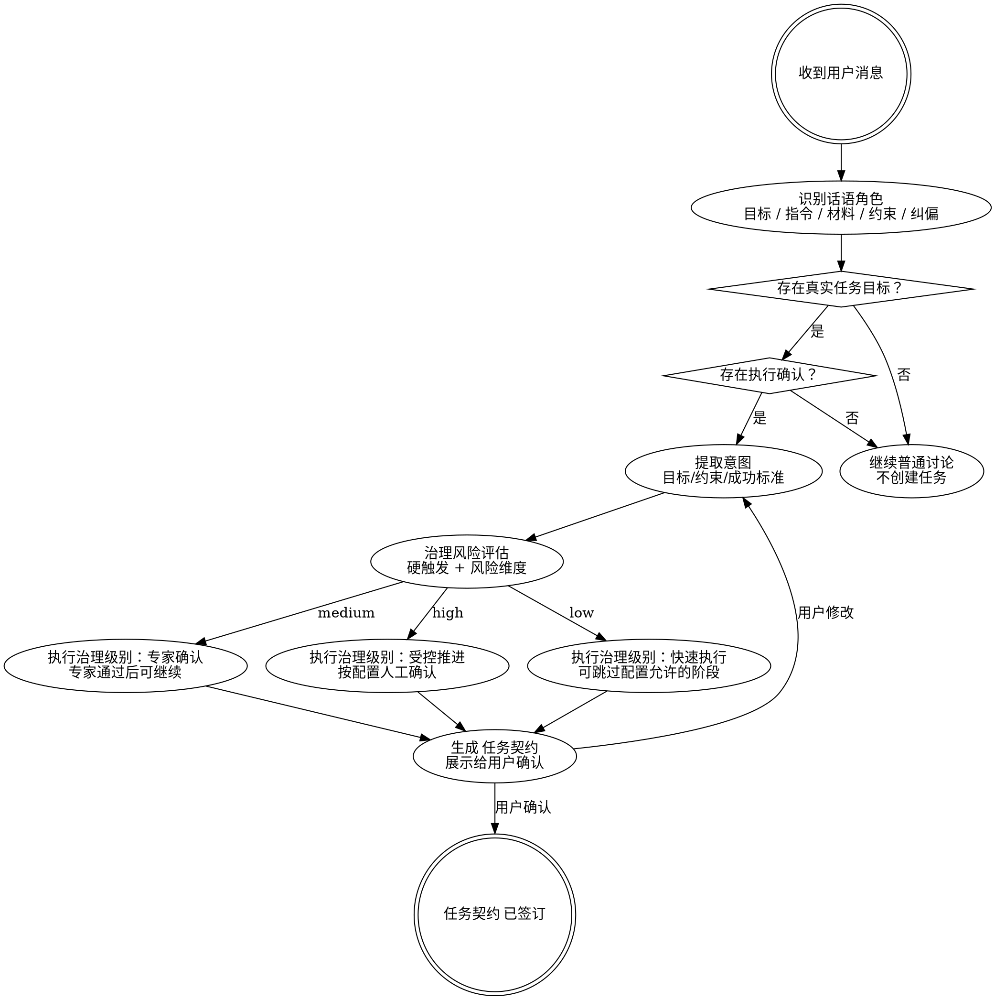

> **执行 Agent**：由本阶段 `workflow.md` 的角色策略声明；若运行时无法调度所需 Agent 角色，停在关口并报告角色不可用，不得由主 Agent 按本工作流自写自审。

# 任务接入 — 任务接收与合同签订

## 概述

将模糊的用户意图转化为明确的任务契约。**没有用户自然表达执行意图，不创建任务；没有识别出真实任务目标，不创建任务；没有签订契约，不开始任何工作。**

任务契约必须携带可供产品定义阶段消费的产品故事上下文：用户、问题、场景、价值、成功指标。只写“角色 / 目标 / 价值”的薄用户故事不够，审查员应保持。

## 何时使用

- 用户给出新任务或新需求
- 用户描述了一个问题但没说怎么解决
- 用户说"开始"、"帮我做"、"我要"、"能不能"
- 收到一段描述，不确定是新任务还是对现有任务的补充
- 上一个任务已完成，用户开始新话题

## 何时不使用

- 用户只是问问题、聊天、不涉及执行
- 当前任务正在执行中，用户的消息是对当前任务的补充（→ 走中途纠偏）
- 需求还是想法 / 方向、"具体要做成什么样"没想清，且用户想先想透 → 先走 `brainstorm`（接入前脑暴），它收敛后再交棒本阶段

## 与 brainstorm 的衔接

`brainstorm` 是本阶段的**可选前置**：需求模糊时先在那里把"要什么"想透，落成脑暴活文档，收敛后才交给 intake。衔接约定：

- 存在**已收敛**的脑暴活文档（`harness-runtime/harness/brainstorms/<slug>.md`）时，把它整体作为 `source_material` + `discussion_output` 纳入 `raw_intake_brief`。
- 其中**用户已确认的收敛"目标"**可作为 `actual_task_goal` 候选，但**仍受本阶段 `task_goal_fidelity` 校验**，不是免检直通；脑暴活文档作为整体仍是 `discussion_output`，不因为"脑暴过了"就把里面任何表述直接当目标。
- 脑暴里的"范围方向""验收轮廓"只作参考输入，不直接当成最终范围 / 验收场景 / 条件——严谨定义仍由本阶段及下游 discovery / prd 完成。

## 意图本体识别

正式任务接入前必须先判断用户话语在对话中的作用，而不是把“最近一句话”直接当任务目标。

| 话语角色 | 含义 | 是否可进入任务目标 / 交付物 |
|----------|------|---------------------------------------------|
| `actual_task_goal` | 用户真正想达成的外部结果：系统、产品、代码、流程或行为完成后应处于什么状态 | 是 |
| `agent_instruction` | 用户要求 Agent 怎么工作，例如“仔细读”“先看下”“分析一下”“开始推进” | 否，只能作为工作方式或确认来源 |
| `process_constraint` | 用户要求 Harness 怎么治理，例如走完整流程、不要用“最小实现”、需要受控推进 | 否，只能作为约束 |
| `source_material` | 用户提供的文档、链接、截图、讨论材料 | 否，只能作为输入材料 |
| `discussion_output` | 讨论阶段产生的 PRD、方案、任务契约、调研文档等中间产物 | 默认否，除非用户明确要求交付该文档本身 |
| `correction` | 用户指出理解错误、范围错误、目标错误 | 否，应触发中途纠偏或回到讨论 |
| `execution_confirmation` | “开始吧”“继续推进”“按这个来” | 只确认已识别的 `actual_task_goal`，不能单独生成目标 |

硬规则：

- Mission 的目标只能来自 `actual_task_goal`。
- “仔细读某文档”“看下这个方案”“开始推进吧”不是任务目标。
- “开始推进”只能确认一个已经清楚的真实任务目标；如果没有 `actual_task_goal`，保持 discussion 并只问一个短问题。
- “新任务”“新需求”“接下来我要”“我要对 X 继续迭代”“帮我实现 X”“开始做 X”这类表述只要同时给出外部结果，就视为 `formal_intake`；其中“先规划”“规划时参考某项目”是过程约束或输入材料，不得把正式接入降级为普通讨论。
- Harness 阶段产物不是最终交付物，除非用户明确说要交付该文档本身。

## 核心流程

## 治理风险评估

治理级别判断的是“AI 是否被授权自主推进”，不是单纯工作量大小。文件数、角色数、模块数只作为规模信号；核心判断必须先看硬触发，再看决策风险、可逆性、影响面、验证可靠性、数据/权限/外部依赖和 Agent 行动权。

> 详细治理风险矩阵和执行治理级别（`autonomy_level`）对应关系见 `workflow.md` 第 3 阶段“治理决策”。

## 阶段要素模型

本阶段必须维护的关键要素见 `.harness/docs/methodologies/stage-element-model.md#intake`。摘要：

| 要素 | 被谁使用 | 缺失后果 |
|---|---|---|
| 真实任务目标 | 任务契约 / 探索 / 产品定义 | 把阅读动作、流程要求或 Agent 指令误写成任务目标 |
| 成功定义 | 产品定义 / 验证 / 交付 | 下游无法判断“完成” |
| 范围边界 | 产品定义 / 方案 / 拆解 | 任务扩张或错误收缩 |
| 治理级别 | 阶段关口 / 自治循环 | 该人工确认时自动推进 |

按 `workflow.md` 执行详细步骤。
# 任务接入工作流

将用户意图转化为已绑定工作图（Work Graph）的任务契约（Mission Contract）。审查员和关口都通过后才向用户确认。

下文出现的所有 `harness ...` 命令一律通过 harness-cli 技能调用（默认带 `--json`、消费类型化载荷（typed payload）、不直接拼 Bash 底层脚本，详见 `.harness/common/skills/harness-cli/SKILL.md`）。

<workflow stage="intake" version="2">

### 第 0 阶段 — 接入模式关口与控制面预检

<step n="0" phase="0" goal="判断是否进入正式任务接入（intake）；正式任务接入时初始化控制面">

先做语义角色判断，不得把最近一句用户消息直接当任务目标。把用户当前消息和必要上下文拆成：

- `actual_task_goal`：用户真正想达成的外部结果；完成后系统 / 产品 / 代码 / 行为应处于什么状态。
- `agent_instruction`：用户要求智能体（Agent）怎么工作，例如“仔细读”“看下”“分析”“开始推进”。
- `process_constraint`：用户要求 Harness 怎么治理，例如完整流程、受控推进、不要用“最小实现”。
- `source_material`：用户提供的文档、链接、截图或讨论材料。
- `discussion_output`：PRD、方案、任务契约、调研文档等讨论 / 阶段中间产物。
- `correction`：用户指出理解错、目标错、范围错。
- `execution_confirmation`：“开始吧”“继续推进”“按这个来”等执行确认。

- 硬关口 `actual-task-goal-required`：
没有明确 `actual_task_goal` 时，即使用户说“开始推进”“继续”“按这个来”，也不得进入正式任务接入（`formal_intake`）；这些话只能确认已识别目标，不能生成目标。只问一个短问题澄清真实外部结果，例如“你要推进的是哪个可交付结果？”

- 硬关口 `meta-instruction-not-objective`：
`agent_instruction`、`process_constraint`、`source_material`、`discussion_output`、`correction` 不得写入任务目标、工作图节点标题或成功定义中的交付物（`success_definition.deliverables`）。它们只能进入输入材料、约束、非目标、确认来源或纠偏记录。

根据语义角色和当前对话判断 `intake_mode`：

- `discussion`：缺少 `actual_task_goal`，或只有想法、要求、问题、约束、阅读要求、资料提供、纠偏意见、流程要求。
- `formal_intake`：已存在明确 `actual_task_goal`，且用户自然表达执行确认，例如“开始吧”“就这么做”“帮我实现”“按这个来”“继续推进”。
- `formal_intake` 也包括用户直接声明“新任务 / 新需求 / 接下来我要 / 我要对 X 继续迭代 / 开始做 X”，并给出明确外部结果的场景；“先规划”“规划时参考 X”只进入 `process_constraint` 或 `source_material`，不改变正式接入判断。

- 条件：`intake_mode=discussion`
不得调用以下命令或写入以下控制面：
- `harness control status`
- `harness control candidates`
- `harness config snapshot`
- `harness context check`
- `harness mission status --open`
- `harness mission new-id`
- `harness trace log-init`
- `git-workflow prepare`
- `harness mission init`
- `harness graph node create`
- `harness mission create-slice`
- `harness board select --write-slice`
- 写 `mission-contract.md` / `intent-framing.yaml` / 关口报告（Gate report）

只做内部接入前判断。用户可见输出必须是普通对话，不得像调研访谈、执行前对齐模板，也不得暴露 Harness 内部控制面或契约格式：
- 不说 `pre-intake frame`、`Mission`、`Work Graph`、`Mission Slice`、`contract`、`SCN-*`、`US-*`、`GWT`、“正式接入”、“接入任务”等内部术语
- 不说“我先不建任务”“你可以确认接入任务”“等你确认后我再纳入 Harness”这类流程提示，除非用户主动问 Harness 状态
- 不用表格化模板、编号化验收条件或“候选 A/B/C”强行包装普通讨论
- 正常回应用户的想法或要求，不要固定套用“你是想用 X 解决 Y / 我会先按 A 做”句式
- 如果想更准确地完成，只用一句自然语言提示用户可以说明期待的验收条件包含哪些
- 只有缺失信息会导致执行方向明显不同，才问 1 个简短问题；不要做用户画像、场景调研、边界设计访谈或一次性问卷
- 结构化字段只在用户自然表达执行意图后写入 `intent-framing.yaml` 和任务契约（Mission Contract），不提前暴露给用户

用户未提供 `actual_task_goal` 且未等价自然表达执行确认时，工作流在此返回，不进入第 1 阶段。

- 条件：`intake_mode=formal_intake`
构造类型化 `raw_intake_brief`，必须分栏记录：
- `actual_task_goal`
- `source_materials`
- `agent_instructions`
- `process_constraints`
- `discussion_outputs`
- `corrections`
- `execution_confirmation`
- `explicit_non_goals`
- `open_intent_gap`：用户意图中已暴露但不应由任务接入阶段（intake）解决的探索型未知项。若缺口会阻断目标、交付物或验收口径确认，必须回讨论模式（discussion）/ AskUserQuestion，不得交给探索阶段（discovery）猜测。

`open_intent_gap` 分流方法：
1. 先问“这个未知项是否会改变目标、主要交付物、范围边界或验收口径”。会改变的，归为阻断型缺口，回讨论模式（discussion）/ AskUserQuestion。
2. 再问“这个未知项是否只影响后续事实取证、业务对象候选、系统边界、依赖、风险或产品定义输入”。是的，才归为探索型缺口。
3. 每条探索型缺口按约定模板记录：`问题 / 来源 / 影响 / 交给探索阶段的原因 / 边界`，边界必须说明探索阶段不得替代完成的下游工作。

只有 `actual_task_goal` 能进入目标（`objective`）、工作图节点标题、成功定义中的交付物（`success_definition.deliverables`）和验收条件。

调 `harness control status --json` + `harness control candidates --intent continue --json`。有可恢复活动任务（active mission）候选时返回用户决定，不得自作主张。

状态说明必须分层：`control status` / `candidates` 只说明当前是否有可恢复任务，不代表 Harness CLI 是否可用。若没有 active/open Mission 或 continue 候选，用户可见说明应写成“当前没有可恢复 Mission，本轮将创建新 Mission”，不得写成 CLI 不可用或任务无法接入。

调 `harness config snapshot --json`，取 `project_name` / `default_mode` / `brownfield` / `execution_governance` / `escalation` / `work_graph`。

调 `harness context check --json`。FAIL 时按 project-context 规则处理或记 `inputs_missing.project_context=true`。

调 `harness graphify status --json`，仅作为 informational 信号纳入 `inputs_missing.graphify`：
- `cli_installed=false` ⇒ 提醒用户机器层未装 Graphify（PyPI 包 `graphifyy` 双 y）；不阻断接入，但若任务后续判定为既有项目（brownfield），discovery 阶段会拦下。
- `cli_installed=true && available=false` ⇒ 提醒项目层未建图；建议在 `generate-context` 阶段同步跑 `graphify .`。
- 接入阶段（intake）不替用户跑 `pip install` / `graphify .`；只产出提醒。

调 `harness mission status --open --json` 列未完成 mission。

控制面查询不可用时按旧运行时（runtime）文件读取，记录 `fallback_used` / `fallback_reason` / `legacy_source` / `follow_up`。

</step>

### 第 1 阶段 — 意图与工作图绑定

<step n="1" phase="1" goal="确立任务身份并完成工作图绑定">

读类型化 `raw_intake_brief`，只从 `actual_task_goal` 识别核心意图，判断全新项目 / 既有项目。此时不得写 `mission-contract.md`，也不得调度框定专家。

- 硬关口 `execution-intent-before-runtime-write`：
没有用户自然表达执行确认时，第 1 阶段阻断；不得创建任务编号、追踪记录、任务分支、工作图节点、任务切片或任何任务契约产物。

- 硬关口 `actual-task-goal-before-runtime-write`：
`raw_intake_brief.actual_task_goal` 为空，或只能从阅读动作、流程要求、讨论产物、纠偏反馈推断目标时，第 1 阶段阻断；回第 0 阶段讨论模式。

- 条件：用户意图模糊或范围不清
调 AskUserQuestion 三候选问题：
- Q1：期望完成后看到什么具体结果？
- Q2：最终交付物和交付标准是什么？
- Q3：哪些东西明确不需要做？有什么已知约束或依赖？

回答追加到类型化 `raw_intake_brief`。若回答后仍缺少 `actual_task_goal`、交付标准、范围边界或验证口径，回第 0 阶段讨论模式；运行时不支持结构化 AskUserQuestion 时降级自然语言提问。

调 `harness mission new-id --slug <slug> --json` 取 `mission_id`（禁止 agent 自拼）。

调 `harness trace log-init --mission <mission_id> --stage intake --json`。
调 `harness trace step-enter --mission <mission_id> --step phase-1 --json`。

调 `git-workflow prepare` 创建 `mission/<mission_id>` 分支并进入。

- 硬关口 `git-prepare-before-runtime-write`：
`git-workflow prepare` 之前不得写 `mission-status.yaml` / 工作图节点 / 任务切片（Mission Slice）/ 关口报告（Gate report）/ 规划文档 / 阶段产物；用户说“先规划”时，规划文档也必须落在 mission branch 之后。

调 `harness mission init --json`（已存在则通过且不操作（PASS-noop），不传 `--replace`）。
调 `harness graph rebuild --json` + `harness graph check --json`。

- 硬关口 `work-graph-ready-before-framing`：
`work_graph.lanes` 缺失或 `harness graph check` 失败：第 1 阶段阻断，不得进入第 2 阶段。

调 `harness board select --mission <mission_id> --query <raw_intake_brief> --no-write --json` 查重复 / 相关 / 冲突 node。

- 条件：已有 node 与本任务等价
记录为种子节点。
- 条件：是新需求
调 `harness graph node create --node-id <id> --kind <kind> --title <title> --lane <lane> --stage <stage> --status <status> --mission-id <mission_id> --json`。kind 来自 `harness config snapshot` 的 `work_graph.node_kinds`：需求 → `REQ-*` / `EPIC-*`；缺陷 → `BUG-*`；调研 → `RESEARCH-*`。`--stage` 必须来自目标 lane 的当前阶段（通常是 `intake`），不得省略。创建后再调 `harness graph rebuild` + `harness graph check`。

调 board-router 为 `mission_id` 创建 / 恢复任务切片（Mission Slice）：`harness mission create-slice --mission <mission_id> --primary-node <node-id> --lane-action <stage> --objective <actual_task_goal 摘要> --json` 或 `harness board select --write-slice`。任务切片创建后再调用 `harness mission stage start`，因为 `stage start` 需要已存在的 Mission 状态和 Mission Slice。

- 硬关口 `mission-slice-required`：
任务切片缺 `work_graph.primary_nodes` 或无法创建 / 关联种子节点：第 1 阶段阻断。

调 `harness mission stage start --mission <mission_id> --stage intake --json`。

- 硬关口 `stage-start-after-slice`：
不得在 `harness mission create-slice` / `harness board select --write-slice` 成功前调用 `harness mission stage start`；否则会触发 `missing_mission`，这不是用户任务缺失，而是生命周期顺序错误。

调 `harness trace step-exit --mission <mission_id> --step phase-1 --status pass --json`。

</step>

### 第 2 阶段 — 意图框定

<step n="2" phase="2" goal="调度框定专家产出意图框定">

调 `harness trace step-enter --mission <mission_id> --step phase-2 --json`。

<dispatch role="mission-framing-expert" mode="spawn" />

任务信封：类型化 `raw_intake_brief` 摘要（必须包含 `actual_task_goal` 与各类非目标语料）、项目上下文（project-context）路径、`harness config snapshot` 摘要、种子节点 YAML 路径、任务切片路径、输出路径 `harness-runtime/harness/missions/<mission_id>/intent-framing.yaml`、写入范围、完成条件。不粘贴配置快照（config snapshot）全文、任务切片 JSON 或工作流正文。

intent-framing.yaml 结构遵循 `harness-runtime/templates/contracts/intent-framing.example.yaml`，验收条件的 `given` / `when` / `then` 平铺，不嵌套 `gwt:`。

intent-framing.yaml 必须包含 `intent_role_analysis`：
- `actual_task_goal`：真实任务目标，目标、交付物和验收条件只能从这里派生
- `source_materials`：输入材料
- `agent_instructions`：工作方式要求
- `process_constraints`：Harness 流程 / 治理约束
- `discussion_outputs`：讨论或阶段中间产物
- `corrections`：用户纠偏
- `execution_confirmation`：执行确认来源
- `open_intent_gaps[]`：只记录探索型未知项，作为探索阶段（discovery）输入；每条包含问题、来源、影响、交给探索阶段的原因和边界
- `excluded_from_objective`：明确列出未进入目标的语料及原因

`open_intent_gaps[]` 写入约定：
- `question` 写待查事实，不写成方案选择或需求结论。
- `source` 写用户原话、材料位置或意图框定依据。
- `impact` 写它会影响哪个下游判断，例如事实取证、业务对象候选、系统边界、依赖风险或产品定义输入。
- `reason_for_discovery` 写为什么任务接入阶段不解决、为什么探索阶段适合取证。
- `boundary` 写停止条件：不得改写成目标、范围、验收条件、最终业务对象模型、系统用例或技术方案。

如果 `actual_task_goal` 为空或不清楚，框定专家必须返回 `NEEDS_DECISION`，不得生成可通过的意图框定。

intent-framing.yaml 必须包含 `intake_decision` 和 `success_definition`：
- `intake_decision.confirmed=true`
- `intake_decision.confirmation_source` 记录用户自然表达执行意图的原话或等价摘要
- `success_definition.desired_effect` 描述完成后要达到的效果
- `success_definition.deliverables[]` 描述最终交付物和格式
- `success_definition.validation_evidence[]` 描述后续验证和交付阶段用来证明达标的证据类型
- `success_definition.non_goals[]` 记录明确不做的内容；若没有，写空数组并在 scope_out 中解释

intent-framing.yaml 的每条 `user_stories[]` 必须包含产品故事握手字段：
- `role` / `goal` / `value`
- `story_context.user`：用户或用户分层，不只写系统角色名
- `story_context.problem`：该用户遇到的问题、痛点或当前失败状态
- `story_context.scenario`：触发场景 / 使用上下文 / 关键动作，不得留给产品定义阶段（PRD）自行推断
- `story_context.value`：为什么值得做，允许与故事 `value` 一致但必须明确
- `story_context.success_metrics[]`：至少一条可观察成功信号，包含 `signal` 与 `target`

运行时无原生子智能体（Agent）注册表时降级 `main_agent_fallback` 并标 `block_auto_pass`，不得让主智能体自演框定流程同时给出通过结论。

- 硬关口 `framing-expert-not-main-agent`：
框定专家不可调度时停在关口，报告角色不可用，主流程不得自演。

调 `harness trace step-exit --mission <mission_id> --step phase-2 --status pass --json`。

</step>

### 第 3 阶段 — 治理决策

<step n="3" phase="3" goal="主流程完成治理决策">

调 `harness trace step-enter --mission <mission_id> --step phase-3 --json`。

复核框定专家的治理风险建议。治理级别判断的是“人工智能（AI）是否被授权自主推进”，不得只用文件数、用户角色数或模块数代替风险判断。按本文末治理风险矩阵执行：

1. 先检查硬触发项；命中任一项即 `high` / `受控推进`。
2. 再评估核心风险维度；任一核心维度为高风险即 `high` / `受控推进`。
3. 无高风险但存在中风险核心风险，或只有规模信号较大但核心风险可控，则 `medium` / `专家确认`。
4. 全部核心风险低、范围局部、可逆且自动验证充分，才可 `low` / `快速执行`。

文件数、角色数、模块数只写入 `scale_signals`，不得把“文件少”作为降低安全、数据、外部依赖或智能体（Agent）行动权风险的理由。最终治理理由写回 `intent-framing.yaml` 的 `governance_assessment`。

设 `autonomy_level`：

| 治理风险 | 自治级别 | 含义 |
|------|--------|------|
| low | 快速执行 | 允许跳过 `skippable_stages` 内的阶段 |
| medium | 专家确认 | 专家审查员 + 阶段关口（Stage Gate）通过（PASS）通常即可继续 |
| high | 受控推进 | 默认不跳过，按配置决定人工确认点 |

使用标准中文值，A1 / A2 / A3 等旧别名由 `harness contract fill` 命令拒绝。

从 `harness.yaml` 的 `execution_governance.levels.<level>` 取 `skippable_stages` / `reviewer_pass_sufficient` / `human_checkpoints`。

- 硬关口 `autonomy-level-must-exist`：
找不到对应级别：第 3 阶段阻断，不得回退到旧 `checkpoints`。

设 `required_checkpoints`：默认 = 治理级别的 `human_checkpoints`；可因风险、用户要求或范围变化显式增减，理由记入 `intent-framing.yaml`。若人工智能（AI）建议从 `受控推进` 降级，或从默认检查点中移除阶段，必须在第 6 阶段明确展示给用户确认；用户同意后通过审批记录（approval）记为 `risk_acceptance` 或 `tradeoff`。

设 `escalation_triggers`：从 `harness config snapshot` 的升级规则摘要派生。

- 条件：`agent_engineering.enabled=true` 且智能体（Agent）行动权 / 智能体复杂度 >= medium
意图框定（intent framing）标记涉及智能体（Agent）组件。最终任务契约（Mission Contract）的 `## 智能体工程` 段必须声明后续设计阶段对子 Agent `agent-capability-designer` 与 `agent-capability-reviewer` 的调度计划，并在 `solution.md` 的智能体架构章节（当前锚点 `## Agent 架构`）完成工作权决策、在 `tech-design.md` 的智能体实现章节（当前锚点 `## Agent 实现`）完成承载物实现规格。

决策字段（`governance_risk` / `autonomy_level` / `governance_assessment` / `required_checkpoints` / `escalation_triggers`）写回 `intent-framing.yaml`。

调 `harness trace step-exit --mission <mission_id> --step phase-3 --status pass --json`。

</step>

### 第 4 阶段 — 契约构建

<step n="4" phase="4" goal="生成最终任务契约">

调 `harness trace step-enter --mission <mission_id> --step phase-4 --json`。

调 `git-workflow start-stage(intake)` 创建 `stage/<mission_id>-intake` 和任务接入阶段（intake）的阶段工作树（worktree）。

- 硬关口 `stage-worktree-required`：
`mission-contract.md` 必须写入任务接入阶段（intake）的阶段工作树（worktree）（除 `git.strategy == downgraded`）。
- 硬关口 `mission-slice-still-bound`：
任务切片缺失 / `primary_nodes` 空 / `control_plane.stage` 空 / 种子节点不存在：第 4 阶段阻断。

用 `harness-runtime/templates/mission-contract.md` 模板，合并意图框定（intent framing）+ 任务切片（Mission Slice），写入 `harness-runtime/harness/missions/<mission_id>/mission-contract.md`，必须包含：

- 外部契约引用：`Contract: contracts/mission-contract.contract.yaml`，禁止追加围栏 YAML / `intent_contract` / `execution_result` / `role_verdicts` 段
- 摘要、目标、用户故事（`US-*` 稳定 ID + 角色 / 目标 / 价值 + 产品故事上下文：用户 / 问题 / 场景 / 成功指标 + 验收条件追溯，不用前置-动作-结果（GWT）代替）
- 范围内 / 范围外、验收条件（前置-动作-结果（GWT）格式；场景编号只作追溯锚点）
- 待探索问题：从 `raw_intake_brief.open_intent_gap` / `intent_role_analysis.open_intent_gaps[]` 继承，明确哪些未知项交给探索阶段（discovery）建立事实、影响和风险；必须保留分流方法和约定模板（问题 / 来源 / 影响 / 交给探索阶段的原因 / 边界），不得把待探索问题改写为目标、范围、验收条件或业务对象模型结论
- 执行治理级别（标准中文）、治理风险依据（硬触发项 / 风险维度 / 规模信号 / 决策规则）、可跳过阶段、专家确认足够阶段、必需检查点
- 工作图：`primary_nodes` / `related_nodes` / `operation` / `from_lane` / `to_lane`
- `control_plane`：`lane` / `stage`；执行快照（execution snapshot）在 `lane_action`
- 角色策略覆盖（仅任务级调整时记录 + 理由）
- 升级规则 / 约束 / 交付预期

调 `harness contract fill --mission <mission_id> --stage intake --artifact harness-runtime/harness/missions/<mission_id>/contracts/mission-contract.contract.yaml --intent-framing harness-runtime/harness/missions/<mission_id>/intent-framing.yaml --template mission-contract --json`。自动同步 `autonomy_level` 到 `mission-status` 条目。

`execution_result` 用 `harness contract add-execution-result`，`role_verdicts` 用 `harness contract record-review`；只有导入既有 verdict manifest 时才用 `harness contract add-verdict`。这些结构化结果不塞进 intent-framing.yaml。

`fill` 未覆盖的实验字段或任务切片绑定才用 `harness contract patch`，写明被修改字段；不得用 `patch` 重做整段业务字段。

调 `harness trace step-exit --mission <mission_id> --step phase-4 --status pass --json`。

</step>

### 第 5 阶段 — 审查与关口

<step n="5" phase="5" goal="审查员循环 + 关口自检">

调 `harness trace step-enter --mission <mission_id> --step phase-5 --json`。

- 循环：id=reviewer-loop；无轮次放行（producer-fixable 缺口不设通过上限，轮次只记录修复历史）；退出条件：审查员在等同严格度下返回通过 / 无阻断

调 `harness trace step-enter --mission <mission_id> --step phase-5-review --rounds <n> --json`。

<dispatch role="mission-contract-effectiveness-reviewer" mode="spawn" />

任务信封：`mission-contract.md` 路径、`mission-contract.contract.yaml` 路径、任务切片路径、种子节点 YAML 路径、类型化原始接入摘要（raw intake brief）、第 0 阶段语义角色判断、第 3 阶段治理风险结论、`project-context` 范围 / 约束摘要。不粘贴任务契约全文或契约 YAML 全文。

要求 `role_verdict` 覆盖：执行意图来源是否存在、`task_goal_fidelity`（目标、交付物、验收条件和工作图标题是否只来自真实任务目标）、下游猜测测试（下游是否还需要自行发明用户、场景、范围或验证口径）、待探索问题是否从原始接入摘要（raw intake）/ 意图框定（intent framing）显式交接给探索阶段（discovery）、虚构范围检测（是否把未授权扩张写入范围内）、`success_definition` 是否足以指导验收、交付标准是否清楚、用户故事是否包含用户 / 问题 / 场景 / 价值 / 成功指标并追溯验收条件、范围内 / 范围外防蔓延、验收条件是否可观察 / 可复现 / 可形成预期结果与实际结果对比 / 可被证据引用、验证证据是否能支撑最终验收、`autonomy_level` / 检查点与治理风险是否匹配、工作图绑定完整性、阻断性缺口。

- 分支：审查结论
- 情况：保持（HOLD）/ 阻断（BLOCKED）/ 有阻断
修复 `mission-contract.md` 与 `contract.yaml`。调 `harness trace step-exit --mission <mission_id> --step phase-5-review --rounds <n> --status fail --json`，回循环开头重审全文。

- 硬关口 `no-skip-recheck-after-fix`：
审查员重审通过（PASS）之前不得退出循环。
- 情况：通过（PASS）/ 无阻断
调 `harness trace step-exit --mission <mission_id> --step phase-5-review --rounds <n> --status pass --json`，退出循环进入关口自检。

- 条件：卡死——同一阻断在修复后，审查员仍以相同根因连续 HOLD 且无实质进展（按缺口本质判断，不是"轮次到点"）
不得降级通过。按 `core.md`「严格审查不变量」重新归因：producer 能补则留在循环升级修复策略继续重做；本质是任务范围 / 验收口径需用户定义才能解时，调 AskUserQuestion，候选（**不含"接受降级 / 降级通过 / 重置轮次继续"**）：

- **A：调整范围 / 验收条件** → 按用户指导修改 mission-contract.md，回循环开头继续修
- **B：升级决策关口** → 调 `harness approval require --mission <mission_id> --type tradeoff --stage intake --json`，工作流暂停
- 残留风险只能由用户在充分披露完整未解决发现后于 Decision Gate 显式拥有：仅此时调 `harness approval append --mission <mission_id> --type tradeoff --stage intake --status approved --comment "<用户原话>" --json`，`contract.yaml` 的 `role_verdicts` 保留未解决发现项（findings）并标 `accepted_by_user=true`。审查循环本身永不把未解决阻断自动转为通过。

审查摘要附加到 `mission-contract.md` 末尾；结构化审查结论优先通过 `harness contract record-review` 写入 `contract.yaml`，由 CLI 同步维护 `role_verdicts`、`effectiveness_review.rounds_used`、`last_verdict` 和 reviewer dispatch evidence。只有在导入既有 verdict manifest 时才使用 `harness contract add-verdict`。

调 `harness contract check-recheck-pending --artifact harness-runtime/harness/missions/<mission_id>/contracts/mission-contract.contract.yaml --json`。失败则回审查员循环开头。

调 `harness gate run --stage intake --mission <mission_id> --mission-slice <slice-path> --artifact harness-runtime/harness/missions/<mission_id>/mission-contract.md --contract-artifact harness-runtime/harness/missions/<mission_id>/contracts/mission-contract.contract.yaml --ai-interpretation "intake artifact gate self-check after reviewer PASS" --json`。这是用户确认前的自检，不推进 Work Graph。

- 硬关口 `gate-before-user-confirm`：
关口失败时不得进入第 6 阶段。按返回的 `failed_checks` 修复 → 回第 4 阶段 → 回第 5 阶段审查员循环 → 再跑 gate run。

调 `harness trace step-exit --mission <mission_id> --step phase-5 --status pass --json`。

</step>

### 第 6 阶段 — 用户确认与阶段退出

<step n="6" phase="6" goal="向用户确认并完成阶段退出">

调 `harness trace step-enter --mission <mission_id> --step phase-6 --json`。

调 `harness contract summary --mission <mission_id> --format user --json`，用返回的 `user_text` 作为摘要展示给用户（不自由组织文字）。

治理级别是授权边界，第 6 阶段必须让用户明确确认：建议治理级别、硬触发项、核心风险维度、必需检查点。若用户选择降低治理级别、移除检查点或接受未解决风险，必须调用 `harness approval append --type risk_acceptance|tradeoff --stage intake --status approved --comment "<用户原话>" --json` 后再完成阶段。

调 AskUserQuestion，4 候选：

- **A：确认开始** → 任务契约阶段完成，自治循环接管后续调度
- **B：调整范围** → 修改 mission-contract.md / intent-framing.yaml，回第 5 阶段
- **C：调整验收条件** → 同 B
- **D：调整自治级别 / 检查点** → 同 B

- 条件：仅文字微调（不触及 ID 或结构）
重新调 `harness contract summary --format user` 展示并再问，无需回第 5 阶段。

调 `harness gate transition --stage intake --mission <mission_id> --mission-slice <slice-path> --artifact harness-runtime/harness/missions/<mission_id>/mission-contract.md --contract-artifact harness-runtime/harness/missions/<mission_id>/contracts/mission-contract.contract.yaml --ai-interpretation "user confirmed intake contract and artifact gate is passing" --json`；阶段完成、Gate 报告、Work Graph operation、下一 Mission Slice 由 CLI 串联写入，不再单独调用 `mission stage complete` / `gate advance` / `board select`。
调 `harness trace step-exit --mission <mission_id> --step phase-6 --status pass --json`。
调 `harness trace step-exit --mission <mission_id> --step stage-exit --status pass --json`。

</step>

</workflow>

---

## 失败路径

任何阶段的硬关口阻断或关口失败都必须落显式 `harness trace step-exit`。

| 失败类型 | 触发阶段 | 恢复路径 |
|---------|-----------|---------|
| git clean 工作树（worktree）前置失败 | 第 1 阶段 | 解决工作树冲突 → 重跑 `git-workflow prepare` → 回第 1 阶段 |
| 工作图运行时未初始化或 `harness graph check` 失败 | 第 1 阶段 | 修 work-graph 配置 → 重跑 `harness graph rebuild` + `harness graph check` → 回第 1 阶段 |
| 任务切片缺 `primary_nodes` | 第 1 阶段 | 重新走 `harness board select` 或 `harness mission create-slice` → 回第 1 阶段 |
| 框定专家不可调度 | 第 2 阶段 | 停在关口报告角色不可用；按 `harness control candidates` 决定切运行时或升级决策关口 |
| `autonomy_level` 收到旧别名 | 第 3 / 4 阶段 | `harness contract fill` 返回 `LEGACY_LEVEL_REJECTED` 时按 `suggested_value` 改 `intent-framing.yaml` → 重跑 `fill` |
| 审查员循环卡死（修复后仍以相同根因连续 HOLD 无进展，非轮次到点） | 第 5 阶段 | 重新归因；需用户拍板则 AskUserQuestion（候选仅：调整范围 / 验收条件继续修 / 升级决策关口，不含降级通过） |
| `contract check-recheck-pending` 失败 | 第 5 阶段 | 回审查员循环开头重新调审查员 |
| `gate run --stage intake` 失败 | 第 5 阶段末尾 | 按 `failed_checks` 修复 → 回第 4 阶段 → 回第 5 阶段审查员循环 → 再跑 gate run；超过 2 次仍失败则进决策关口 |
| `gate transition --stage intake` 失败 | 第 6 阶段用户确认后 | 按 `failed_step` / `failed_checks` 修复；不得手工补调 `mission stage complete` / `gate advance` / `board select` |
| 用户第 6 阶段选 B / C / D | 第 6 阶段 | 回第 5 阶段审查员循环 + 关口自检 |
| 用户拒绝确认且无具体调整方向 | 第 6 阶段 | 调 `harness approval require --type checkpoint` 标记决策关口，工作流暂停 |

---

## 第 3 阶段治理风险矩阵

### 硬触发项（命中任一项即高风险（high）/ 受控推进）

- 权限、认证、授权边界、安全、隐私、合规、支付、计费、额度或滥用防护。
- 数据删除、数据迁移、数据一致性、不可逆写入、生产数据或跨租户 / 工作区边界。
- 新外部接口（API）/ 服务、真实账号或密钥、非白名单工具、外部依赖不可控。
- 需求边界不清，需要产品 / 业务 / 安全取舍，或存在多个合理路线且选错代价高。
- 智能体（Agent）新能力设计、工具权 / 写入权 / 外部调用权 / 行动权扩大，或智能体边界责任不清。
- 自动验证不足以支撑验收，需要人工判断或用户接受风险。

### 核心风险维度

| 维度 | 低（low） | 中（medium） | 高（high） |
|------|-----|--------|------|
| 决策权 | 实现路径明确，无业务取舍 | 有技术取舍但审查员可判断 | 需要产品 / 业务 / 安全 / 风险接受决策 |
| 可逆性 | 易回滚，无持久副作用 | 回滚有成本但可控 | 难回滚、污染数据或影响用户状态 |
| 影响面 | 局部内部逻辑 | 跨模块或用户可见 | 核心链路、全局行为或多租户边界 |
| 验证可靠性 | 自动测试 / 命令证据可充分覆盖 | 需要组合证据或人工抽查 | 自动证据不足，必须人工验收或接受风险 |
| 数据 / 权限风险 | 不涉及敏感数据、权限或持久化 | 普通数据读写或非敏感权限调整 | 权限、认证、隐私、迁移、删除、一致性 |
| 外部依赖 | 无外部依赖变化 | 已有依赖的新用法 | 新外部 API / 服务、真实账号、密钥或非白名单工具 |
| 智能体（Agent）行动权 | 无智能体行为 / 权限变化 | 调整已有智能体行为但边界清楚 | 新智能体能力、工具权、写入权、外部调用权或责任边界变化 |
| 不确定性 | 验收条件清晰且可直接测试 | 需要产品定义（PRD）/ 方案细化 | 需要调研才能确定需求或方案 |

### 规模信号（辅助，不可单独降低风险）

| 信号 | 低（low） | 中（medium） | 高（high） |
|------|-----|--------|------|
| 变更范围 | ≤ 3 文件 | 4-10 文件 | > 10 文件或新模块 |
| 用户角色 | 单一角色 | 2 个角色 | 3+ 角色 |
| 模块跨度 | 单模块 | 2-3 个模块 | 跨子系统 / 跨应用 |

判定规则：硬触发项或任一核心风险为高风险 → `受控推进`；无高风险但任一核心风险为中风险，或规模信号为中 / 高但核心风险可控 → `专家确认`；全部核心风险低且规模低 → `快速执行`。
