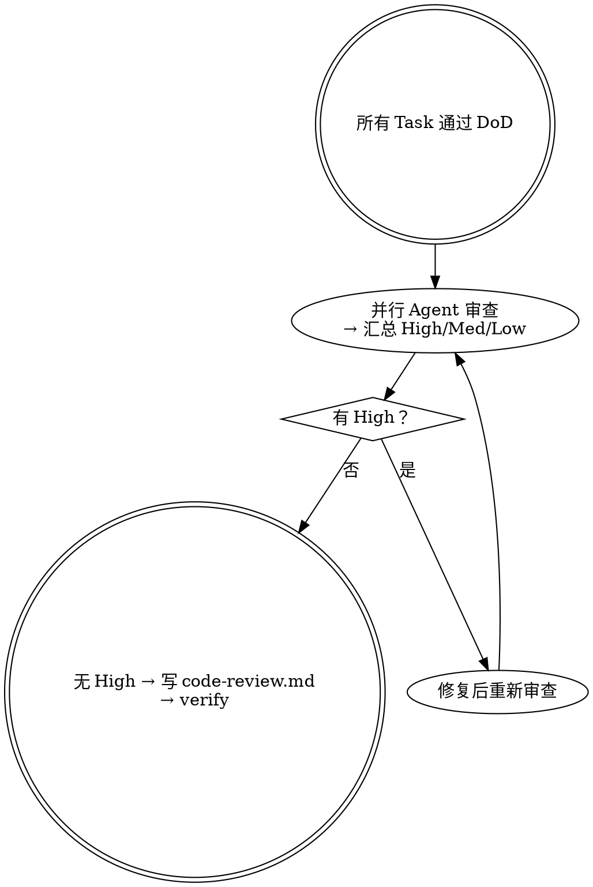

# 代码评审 — 代码评审

## 铁律

```
没有评审通过，不进入交付。
评审发现问题，必须修复后重新评审。
```

## 概述

按变更特征并行唤起审查员；`correctness-reviewer` 与 `tdd-reviewer` 默认必启，`security-reviewer` / `architecture-reviewer` / `data-migration-reviewer` / `e2e-reviewer` / `agent-behavior-reviewer` 按需启用（见 `workflow.md`）。在唤起 `tdd-reviewer` 前先运行 TDD Toolchain 控制面（resolver / runner / normalizer）生成 `toolchain-status.json`；工具链缺口由 Harness 处理，专家只判断测试本身是否能发现错误实现。**审查-修复循环**直至汇总无 High：修复后须重新唤起 Agent 确认，不能改完即止。

## 何时使用

- 所有任务项通过 DoD
- 用户说"做代码审查"、"审查一下"
- 准备提 PR 之前

## 何时不使用

- 任务项还未全部完成（→ 继续执行）
- 只是想看某个函数的逻辑（→ 不需要技能，直接看）

## 评审流程



<HARD-GATE>
存在 High 或未解决的 Blocked（根本偏离）时，不得标为评审通过或进入交付。
</HARD-GATE>

## 反合理化

| 想法 | 现实 |
|------|------|
| "测试都通过了，不需要审查" | 测试验证行为，审查验证意图和质量 |
| "这次改动很小" | 小改动也可能引入架构问题 |
| "只是重构，逻辑没变" | 重构最容易引入微妙缺陷 |
| "赶时间，先交付再说" | 赶时间 + 跳审查 = 技术债 |

## 评审维度速查

| 维度 | Checkpoint |
|------|--------|
| 正确性 | 是否满足 AC / Scenario / delta spec 的用户可观察行为？是否多做或破坏既有行为？ |
| TDD 有效性 | 测试是否追溯到 AC/Scenario？Red/Green 是否有效？断言是否足够强？关键风险是否有 fault detection？ |
| 架构 | 是否符合 solution / tech-design 的模块边界、依赖方向、接口契约、数据流和禁止路径？ |
| 安全 | 是否存在可利用攻击路径、越权、注入、泄露、加密/session/webhook/config 风险？ |
| 数据迁移 | schema / DDL / backfill / data repair 是否具备 dry-run、invariant、rollback/recovery 和兼容性证据？ |
| E2E 有效性 | E2E 是否能证明真实用户路径、用户可观察结果、数据现实性和跨层集成边界？ |
| Agent 行为 | Agent 工作权、边界权、责任权是否落到 prompt、tool、policy/hook、runtime guard 和 eval？ |

## Stage Element Model

本阶段必须维护的关键要素见 `.harness/docs/methodologies/stage-element-model.md#code-review`。摘要：

| Element | Used By | Failure If Missing |
|---|---|---|
| Finding | Execute fix loop | 审查变成泛泛建议 |
| Severity | Stage Gate | 阻断项被放行 |
| Role Boundary | Review summary | 审查职责重叠或遗漏 |
| Evidence | Fix / Audit | finding 不可验证 |
| Resolution Ref | Verify / Delivery | 问题状态不闭环 |

按 `workflow.md` 执行详细步骤。
