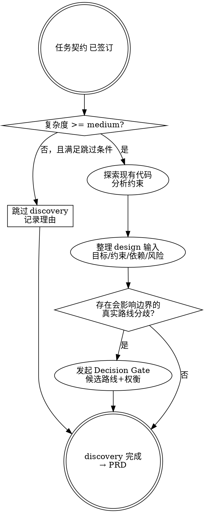

> **执行 Agent**：由本阶段 `workflow.md` 的 role policy 声明；若运行时无法调度所需 Agent role，停在 Gate 并报告角色不可用，不得由主 Agent 按本工作流自写自审。

<HARD-GATE>
复杂度 >= medium 的任务，在 PRD 之前必须执行探索。
跳过探索直接写 PRD = 违规。
</HARD-GATE>

# 探索 — 技术探索与方案设计

## 概述

在写 PRD 之前先探索技术可行性，避免"拍脑袋设计，写完发现不行"。

## 何时使用

- 任务接入评估 `complexity: high` → **必须执行**
- 任务接入评估 `complexity: medium` → **默认执行**，除非用户明确说"不需要探索"
- 涉及新技术栈、新架构模式
- 需要与现有代码集成但不确定接口
- 有多种技术方案需要比较
- 用户说"先分析一下"、"看看怎么做"
- 用户说"项目分析"、"先看下项目"、"分析现有代码/架构/调用链/执行流"

## GitNexus 强制规则

<HARD-GATE>
当探索涉及棕地项目、现有代码理解、项目/架构分析、调用链或执行流时，若 `.harness/common/skills/gitnexus/gitnexus-exploring/` 存在，必须先使用 `gitnexus-exploring` 建立代码库全貌，再进入方案比较。
</HARD-GATE>

执行要求：
- 读取 `.harness/common/skills/gitnexus/gitnexus-exploring/SKILL.md`
- 先检查 GitNexus 仓库上下文：`gitnexus://repos` 与 `gitnexus://repo/{name}/context`
- 用 `gitnexus_query` 查询本次任务相关概念、模块或执行流
- 对关键符号用 `gitnexus_context` 深入调用关系
- 如果索引缺失、过期或 MCP 工具不可用，记录降级原因，并给出补救动作（通常是 `npx gitnexus analyze`）
- 禁止在 GitNexus 可用时只用 grep/文件列表完成"项目分析"

## 何时跳过

以下**全部满足**才可跳过（必须显式记录跳过理由）：

- 任务接入评估 `complexity: low`
- 变更范围 ≤ 3 个文件
- 不引入新模块或新的外部依赖
- 任务契约的范围和 AC 已经具体到可直接写 PRD 的程度
- 用户没有要求探索

**<HARD-GATE> 即使 complexity: low，以下情况仍必须执行：**
- 涉及多个用户角色
- 涉及数据模型变更
- 涉及第三方 API 集成
- 需求中有"探索"、"调研"、"评估"类关键词
- 需求中有"项目分析"、"代码库分析"、"架构理解"、"调用链"、"执行流"类关键词

## 决策流程

## 反合理化

| 想法 | 现实 |
|------|------|
| "这个太简单不需要探索" | 简单任务的未检验假设浪费最多时间 |
| "我已经知道怎么做了" | 知道 ≠ 验证过。先看代码再说 |
| "探索太浪费时间" | 返工浪费的时间是探索的 10 倍 |
| "直接写代码，不行再改" | 这就是反模式的定义 |

## Stage Element Model

本阶段必须维护的关键要素见 `.harness/docs/methodologies/stage-element-model.md#discovery`。摘要：

| Element | Used By | Failure If Missing |
|---|---|---|
| Existing Capability | PRD / Solution / Tech Design | 重复设计或破坏既有行为 |
| Affected Capability | PRD / Dependency Impact / Review | blast radius 被低估 |
| Evidence Source | PRD / Stage Gate | 结论不可追溯 |
| Assumption | PRD / Solution / Decision Gate | 假设被当成事实 |
| Risk / Constraint | Solution / Technical Analysis | 下游设计绕过风险 |

按 `workflow.md` 执行详细步骤。
