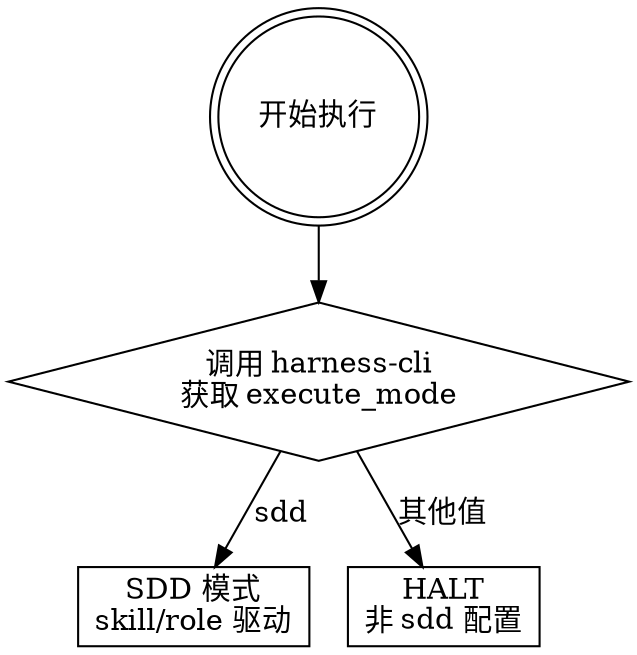

> **执行 Agent**：承担实现任务的当前执行者必须使用本 skill；执行者可以是主 Agent，也可以是被 `spawn_agent` 派发的子 Agent。Work Graph 的 `execute` stage 只能由本技能承载；状态同步、trace 修复或 Work Graph 对齐不能产出 `execution-result.md`，也不能证明实现完成。

# 执行 — 代码实现

## 正常执行入口

所有会写代码或测试的执行者，不管是主 Agent 还是子 Agent，承担实现任务时都必须使用 `execute` skill。`backend-engineer`、`frontend-engineer`、`test-engineer` 等只是 role package，不是独立执行入口；主 Agent 或子 Agent 都不得只凭一个临时专家 prompt 执行实现。

正常执行上下文必须先声明当前 `execution_context.skill` 是 `execute`，且用 `spawn_agent` 派发时，子 Agent prompt 第一段必须是对应执行角色的 role prompt package 完整原文。dispatch plan 只负责解析角色、范围和 brief 边界，不替代 `execute` 本身。

## 铁律

```
没有失败的测试，不写生产代码。
没有运行验证，不宣称完成。
```

## 概述

execute 只遍历 `execution-brief.md#Execution Units` 中每个 Parent task 的 parent-local `atomic_task_queue.execution_units[]`。Parent task 永远是交付切片 / Work Graph TASK 边界，不是可直接派发的实现单位；即使任务很小，也以一个 Atomic Task 执行。默认且唯一有效模式是 SDD：当前执行者负责判断依赖、write scope 和可并行批次，每个 Atomic Task 先生成 dispatch plan；若需要用 `spawn_agent` 分派给工程岗位子 Agent，子 Agent 也必须在 `execute` execution context 中运行，并使用对应 role package。若 parent-local atomic_task_queue 缺失或无效，execute 必须 BLOCKED，并回到 breakdown / Stage Gate 修复绑定。

## 何时使用

- execution-brief 已完成，且 `Execution Units` 中每个 Parent task 都已声明 parent-local `atomic_task_queue`
- 每个 Parent task 的 `atomic_task_queue.status=ready`，并已通过 `execution-plan-effectiveness-reviewer` 审查
- 当前 breakdown 产物包已经通过 Stage Gate，并由 `harness gate advance` 写入 Work Graph / TASK node
- 当前 Mission Slice 的 `control_plane.stage=execute`
- 当前 Mission Slice 的 `lane_action.skill=execute` 或 `lane_action.carrier=execute`
- 用户说"继续执行"、"写代码"、"开始实现"
- 上次执行中断，需要恢复

## 何时不使用

- 没有 execution-brief（→ 先走拆解）
- parent-local atomic_task_queue 缺失、未审查或未通过 Stage Gate 绑定（→ BLOCKED，回到 breakdown / Stage Gate 修复后再执行）
- execution-brief 只是 stage 文件，尚未通过 Stage Gate / `harness gate advance` 同步到 Work Graph（→ 先走 stage-gate）
- 只是讨论方案不涉及编码（→ 走探索）
- 在调试已有缺陷（→ 走 bug-fix；由 bug-fix 按需调用 systematic-debugging）

## 执行模式选择



默认安装配置是 `execute_mode: sdd`。若 workflow 要求用 `spawn_agent` 调用子 Agent 而当前运行环境无法调用，阶段必须停在 Gate 并报告 `BLOCKED`；不得用状态同步或补写结果文件替代执行。

## TDD 循环（每个任务项）

```
Baseline → 复用或建立当前工作区事实
Red → 写失败的测试
Green → 按规格准确实现，让测试通过
Refactor → 在测试保护下重构
```

Baseline 只回答“接手时当前工作区是什么状态”，不是每个新会话的全量测试要求。若已有可信 evidence 覆盖当前 Atomic Task，就复用；若没有，才运行 focused baseline command。这里的"准确实现"指：严格按照当前 Atomic Task 的目标、Parent task 完成边界、测试要求和上游 AC 实现，不缩水、不扩写、不用凑绿补丁替代真实行为。当前执行单元始终来自 Parent task 内的 `atomic_task_queue.execution_units[]`。

## 反合理化检查表

| 禁止 | 正确做法 |
|------|---------|
| "这个太简单不需要测试" | 简单的代码也会出错。写测试。 |
| "我后面补测试" | 后补测试 = 验证实现，不是驱动设计 |
| "测试应该能通过" | 运行它。看输出。 |
| "先写代码更高效" | 先写测试更安全。效率是假象。 |
| "这只是重构" | 重构前确保测试绿灯。 |
| "先做个 MVP/demo 后面再补" | 当前执行单元必须达到对应 Atomic Task 和 parent execution-brief task item 的完成边界；要延后质量项需回到上游文档或 Decision Gate |
| "改动最小所以最好" | 先证明它完整满足 AC、架构约束和维护要求；否则选择更合适的实现 |

## 禁用词

以下词语出现在你的输出中 = 你在跳过验证：

`应该能通过` / `大概没问题` / `理论上可以` / `似乎正确` / `看起来对了`

**替代**：运行命令 → 贴输出 → 陈述事实。

## 快速参考

| 步骤 | 产出 |
|------|------|
| 读取执行单元 | 读取 `Execution Units`；按 Parent task 顺序执行其内嵌 Atomic Tasks |
| 批次规划 | 按依赖、write scope、测试边界和风险分出可并行 / 必须串行的执行批次 |
| Baseline | 复用可信证据，或运行当前 Atomic Task 的 focused baseline command |
| Red | 失败的测试 |
| Green | 通过的代码 |
| Refactor | 干净的代码 |
| 验证 | 测试输出证据 |
| 提交 | git commit |

## 集成

| 技能 | 关系 |
|-------|------|
| `git-workflow` | 执行前准备分支，执行中按 TDD 节奏提交 |
| `execute/dispatch-plan.md` | execute 内部计划生成步骤；每个执行单元执行或分派前生成 dispatch plan，不作为用户入口技能 |
| `code-review` | 所有任务项通过 DoD 后触发 |
| `bug-fix` | 缺陷类失败的主入口，负责复现、根因、修复、回归闭环 |
| `systematic-debugging` | 非缺陷类连续失败或 bug-fix 根因分析时作为 carrier |
| `verify` | 执行完成后触发最终验证 |

## Stage Element Model

本阶段必须维护的关键要素见 `.harness/docs/methodologies/stage-element-model.md#execute`。摘要：

| Element | Used By | Failure If Missing |
|---|---|---|
| Execution Unit | Code Review / Trace | 多做 / 少做 / 跨任务 |
| Red Evidence | TDD Review | 测试不能证明实现有效 |
| Green Evidence | Code Review / Verify | 只声称完成 |
| Changed Surface | Review / Delivery | review 无法聚焦 |
| Regression Evidence | Verify | 修复引入新问题 |

按 `workflow.md` 执行详细步骤。
