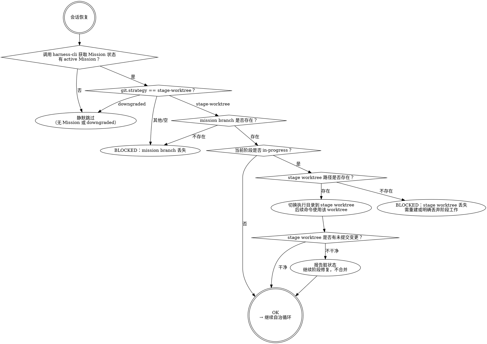
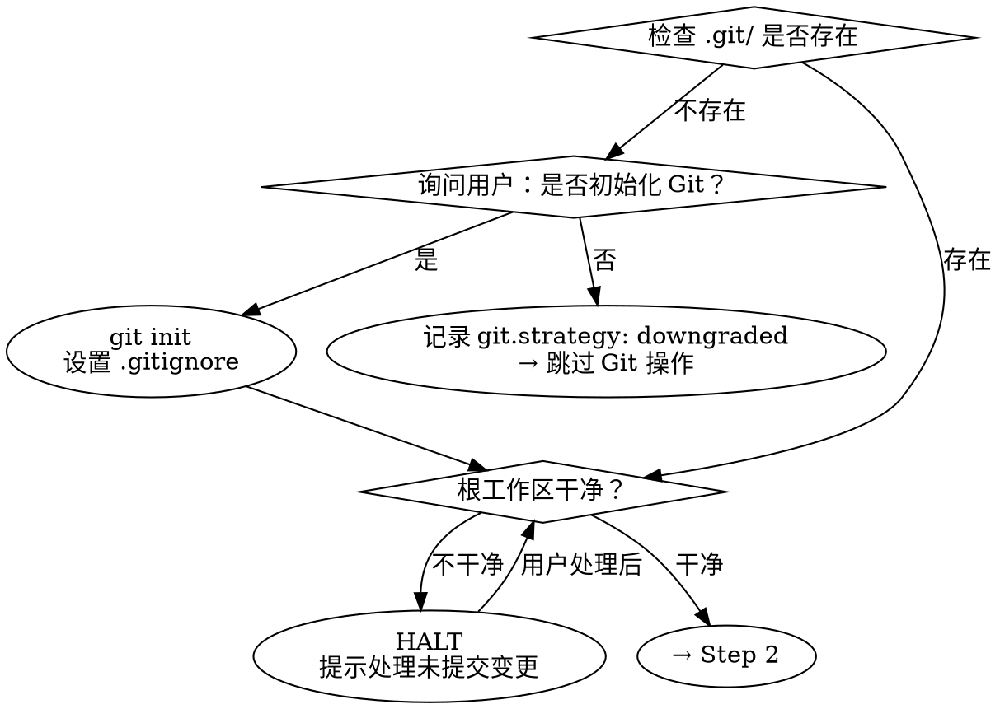
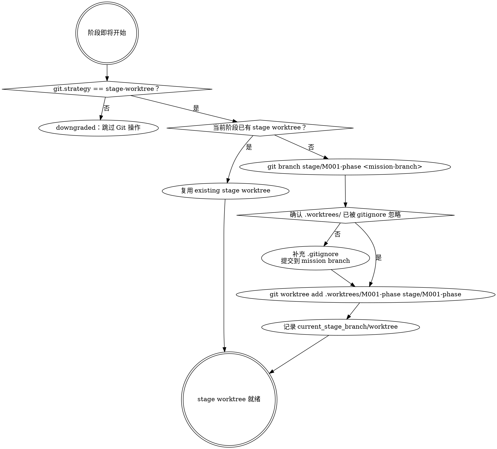

# Git 工作流

**Goal:** 按 Harness Mission 生命周期管理 mission branch、stage branch、stage worktree、阶段产物提交和分支收尾。

**Your Role:** 你是 Git 生命周期执行者。你只按当前操作类型执行对应 Git 步骤，保护已有未提交改动，不替代阶段技能和 Stage Gate。

---

<workflow skill="git-workflow" version="2">

<step n="1" goal="识别 Git 操作类型">
 - 从调用方、当前 Mission 状态和阶段上下文识别本次操作：`recover`、`prepare`、`start-stage`、`commit-artifact` 或 `close`。
 - 条件：操作类型缺失或与当前 Mission 状态冲突
  - 返回 BLOCKED，说明缺少的 Mission / stage / branch / worktree 字段。
</step>

<step n="2" goal="执行对应操作细则">
 - 分支：operation
  - 情况：recover
   - 执行「操作一：recover」检查；只恢复位置，不创建新的 branch / worktree。
  - 情况：prepare
   - 执行「操作二：prepare」；为新 Mission 创建并进入 mission branch，不创建 stage worktree。
  - 情况：start-stage
   - 执行「操作三：start-stage」；为当前阶段创建或复用 stage branch + stage worktree。
  - 情况：commit-artifact
   - 执行「操作四：commit-artifact」；仅在 Stage Gate PASS 后提交 stage worktree 并合并回 mission branch。
  - 情况：close
   - 委托 `finishing-branch` workflow，传入 mission branch、base branch 和未清理 stage worktree 列表。
</step>

<step n="3" goal="记录结果并返回调用方">
 - 将 branch、worktree、commit、merge、close_strategy 或 BLOCKED 原因写回 Mission 状态。
 - 调用 `trace-log` 记录本次 Git 操作结果。
 - 返回调用方继续自治循环；不得在 Git workflow 内跳过 Stage Gate 或直接推进业务阶段。
</step>

</workflow>

---

## 设计原则

本技能覆盖 Git 生命周期的**五个操作**，贯穿任务全程：

| 操作 | 时机 | 核心动作 |
|------|------|---------|
| **recover** | 每次会话恢复 | 读取 Mission / Stage 状态，定位 active stage worktree |
| **prepare** | 新 Mission 接入后（一次性） | 从当前 base branch 创建并进入 mission branch |
| **start-stage** | 每个阶段开始前 | 从 mission branch 创建 stage branch + stage worktree |
| **commit-artifact** | 每次 Stage Gate PASS 后 | 提交 stage worktree → 合并回 mission branch → 清理 stage worktree |
| **close** | retrospective PASS 后 | mission branch 收尾（合并/PR/保留/丢弃） |

---

## 操作一：recover（每次会话恢复）

**目的**：新对话只恢复位置，不创建新的 branch / worktree。



**recover 检查项：**

```bash
git branch --list <mission-branch>
git worktree list
git -C <stage-worktree-path> branch --show-current
git -C <stage-worktree-path> status --porcelain
```

- Hard gate：
recover 不得因为新对话创建 worktree。只有当前阶段已经 `in-progress` 且记录了 stage worktree 时，recover 才进入该 worktree；否则停在 mission branch 状态判断。

---

## 操作二：prepare（新 Mission 接入后，一次性）

**目的**：为 Mission 建立长期集成分支，并让后续 Harness 控制面 bootstrap 写入发生在 mission branch 上；不创建 stage worktree。

### Step 1: 环境检测



- Hard gate：
**Dirty 工作区不是降级条件**。`check_dirty` 走 HALT 分支后，必须由用户处理未提交变更（commit / stash / 显式丢弃），不允许通过把 `git.strategy` 改成 `downgraded` 来绕过。`downgraded` 只在用户主动拒绝 Git 或仓库本身不可用时触发，详见 SKILL.md 的「降级处理」。触发降级时必须同步调用 `harness approval append --type tradeoff --status approved` 写入审批记录，不允许只在 mission-status 文本字段说明。

### Step 2: 读取或推导 Git 约定

**优先级链**：`project-context.md` 中的显式约定 > 从仓库历史推导 > 默认约定。

**默认约定：**

| 类型 | 格式 | 示例 |
|------|------|------|
| Mission 集成分支 | `mission/<mission-id>-<slug>` | `mission/M001-user-auth` |
| Stage 执行分支 | `stage/<mission-id>-{phase}` | `stage/M001-prd` |
| 紧急修复 | `hotfix/<slug>` | `hotfix/fix-login-crash` |
| 探索 | `spike/<slug>` | `spike/evaluate-redis` |

### Step 3: 创建并进入 Mission Branch

```bash
git branch <mission-branch> <base-branch>
git switch <mission-branch>
```

- Hard gate：
prepare 必须先于 `mission init`、Work Graph node 创建、Mission Slice 创建等控制面写入。prepare 只创建并进入 mission branch，不创建 stage worktree。根工作区可以承载 mission 级控制面状态；正式阶段产物和代码仍必须写入 stage worktree。

**记录到 mission-status.yaml：**

```yaml
git:
 strategy: stage-worktree # stage-worktree | downgraded
 base_branch: develop
 mission_branch: mission/M001-user-auth
 current_branch: mission/M001-user-auth
 branch_closed: false
 current_stage_branch: ""
 current_stage_worktree: ""
```

---

## 操作三：start-stage（每个阶段开始前）

**目的**：为当前阶段创建独立执行空间。阶段产物和代码只写入 stage worktree。

**输入**：当前阶段名（由自治循环传入，如 `intake` / `prd` / `execute`）。



**Worktree 目录规则：**

| 项 | 规则 |
|----|------|
| 默认目录 | `<repo-root>/.worktrees/<mission-id>-{phase}` |
| 允许覆盖 | 只有 `project-context.md` 明确写了 worktree 根目录偏好时可覆盖 |
| 冲突处理 | 目录已存在但不是同一 stage branch 时 BLOCKED，不自动复用 |
| 根工作区 | 根工作区不写阶段产物；只允许 Git 受控操作 |

**记录到 mission-status.yaml：**

```yaml
git:
 current_stage: prd
 current_stage_branch: stage/M001-prd
 current_stage_worktree: .worktrees/M001-prd
```

---

## 操作四：commit-artifact（每次 Stage Gate PASS 后）

**目的**：把当前 stage worktree 的结果集成回 mission branch。

**输入**：当前完成的阶段名（由自治循环传入）。

**Commit message 规范：**

| 阶段 | Commit message |
|------|---------------|
| intake | `docs(intake): finalize mission contract [<mission-id>]` |
| 探索 | `docs(discovery): complete discovery brief [<mission-id>]` |
| prd | `docs(prd): finalize requirements [<mission-id>]` |
| 设计 | `docs(design): finalize tech-design [<mission-id>]` |
| 拆解 | `docs(breakdown): create execution brief [<mission-id>]` |
| execute | 按 TDD 节奏产生 `feat` / `fix` / `test` / `refactor` 提交 |
| code-review | `docs(review): code review passed [<mission-id>]` |
| 验证 | `docs(verify): verification passed [<mission-id>]` |
| 交付 | `docs(delivery): delivery package ready [<mission-id>]` |
| retrospective | `docs(retro): retrospective complete [<mission-id>]` |

**执行流程：**

```bash
# 1. 确认 stage worktree 和分支
git -C <stage-worktree-path> branch --show-current
git -C <stage-worktree-path> status --porcelain

# 2. 暂存阶段相关文件
git -C <stage-worktree-path> add <runtime-root>/stages/<mission-id>/
git -C <stage-worktree-path> add <runtime-root>/mission-status.yaml
git -C <stage-worktree-path> add <runtime-root>/missions/<mission-id>/

# execute 阶段可按任务项选择性 add src/tests；不要机械 add 无关文件

# 3. 如有未提交变更，提交到 stage branch
git -C <stage-worktree-path> commit -m "docs({phase}): {description} [<mission-id>]"

# 4. 合并 stage branch 回 mission branch
git switch <mission-branch>
git merge --no-ff <stage-branch>
git switch <base-branch>

# 5. 清理 stage worktree 和 stage branch
git worktree remove <stage-worktree-path>
git branch -d <stage-branch>
```

**合并策略：**

| 情况 | 策略 |
|------|------|
| 单提交文档阶段 | 可 fast-forward 或 `--no-ff`，以仓库约定为准 |
| 多提交执行阶段 | 默认 `--no-ff` 保留阶段边界 |
| 需要线性历史 | 可 squash，但必须保留阶段名、mission-id 和测试证据 |

- Hard gate：
只有 Stage Gate PASS 后才能合并 stage branch。FAIL / BLOCKED 时保留 stage worktree，记录阻塞原因，不合并到 mission branch。

---

## 操作五：close（retrospective PASS 后）

**目的**：决定 mission branch 的去向。

**实现委托给 `finishing-branch` 工作流**，传入当前任务的 mission branch、base branch，以及未清理 stage worktree 列表。

四个选项：

| # | 选项 | 操作 | 清理 |
|---|------|------|------|
| 1 | 合并回 base branch | 合并 + 验证 + 删除 mission branch | 删除已完成 stage worktree |
| 2 | 推送并创建 PR | push + gh pr create | 保留 mission branch |
| 3 | 保持现状 | 报告 mission branch 和剩余 stage worktree | 保留 |
| 4 | 丢弃工作 | 确认后删除 mission branch 和 stage worktree | 删除 |

**完成后记录到 mission-status.yaml：**

```yaml
git:
 branch_closed: true
 close_strategy: merged | pr | kept | discarded
```

**红线：**

- 测试失败时不继续
- 合并前必须验证测试结果
- 未清理的 active stage worktree 必须先处理
- 选项 4 需要用户输入 `discard` 确认
- 未经请求不强制推送

---

## 降级记录

触发条件、禁止的伪降级场景以及必须做的留痕动作见 SKILL.md「降级处理」。记录格式：

```yaml
git:
 strategy: downgraded
 downgrade_reason: <用户原话 | 环境检查输出>
 downgrade_approval_id: <harness approval append 返回的 approval-id>
```

`downgrade_approval_id` 必须有值；缺失视为非法降级，调用方应回到 prepare 重做。所有 Git 操作在 downgraded 状态下跳过实际执行，但每次跳过仍要通过 `trace-log` 写一条 `git_op_skipped` 证据（含操作类型 + 原因），不允许真正无痕。一旦 mission 进入 `downgraded`，本 mission 内不允许切回 `stage-worktree`；如需启用 Git，开新 Mission Slice 重做相关阶段。

---

## 与其他技能的集成点

| 技能 | 集成方式 |
|-------|---------|
| `autonomy-loop` | 会话恢复调 recover；阶段开始前调 start-stage；Stage Gate PASS 调 commit-artifact；retrospective PASS 调 close |
| `intake` | 产生 mission-id / slug 后调 prepare；正式 mission-contract 在 intake stage worktree 中完成 |
| `execute` | 执行阶段在 execute stage worktree 内按 TDD 节奏 commit |
| `code-review` | 使用 `git diff <mission-branch>...<stage-branch>` 或 mission branch 阶段 merge commit 获取变更范围 |
| `finishing-branch` | close 操作委托给分支收尾工作流执行 |
| `generate-context` | 发现并记录项目的 Git 约定 |
| `retrospective` | 分析 mission branch 的阶段集成历史 |
