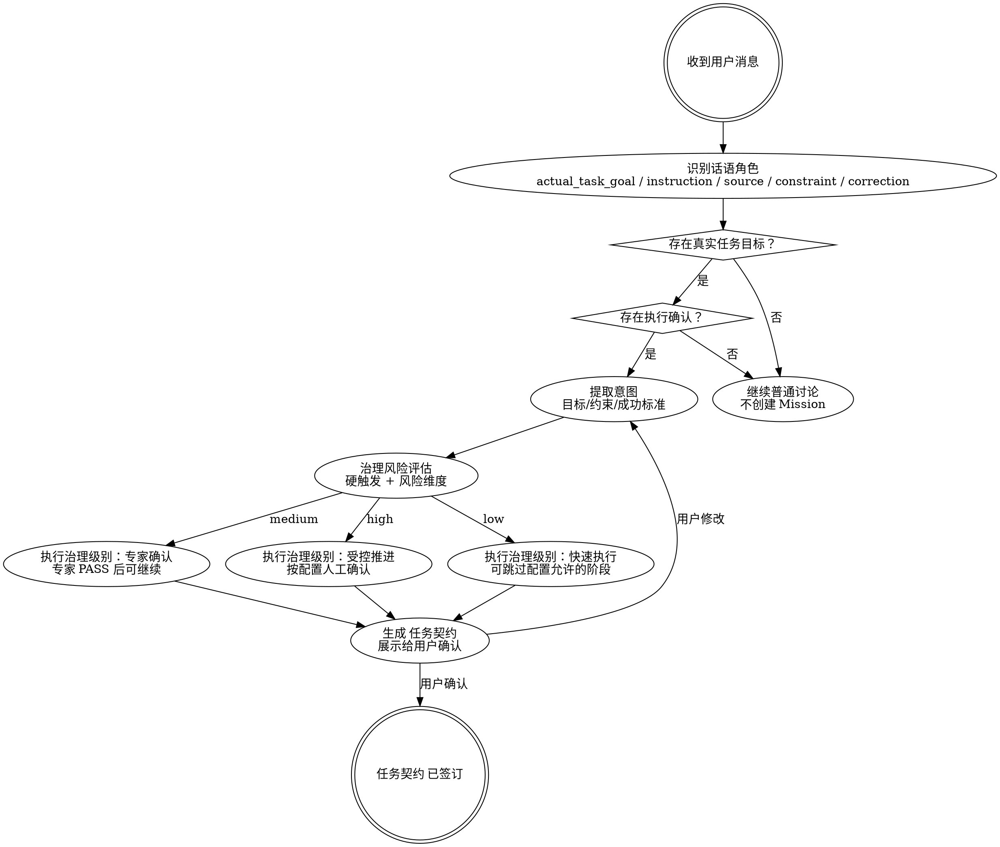

> **执行 Agent**：由本阶段 `workflow.md` 的 role policy 声明；若运行时无法调度所需 Agent role，停在 Gate 并报告角色不可用，不得由主 Agent 按本工作流自写自审。

# 任务接入 — 任务接收与合同签订

## 概述

将模糊的用户意图转化为明确的任务契约。**没有用户自然表达执行意图，不创建 Mission；没有识别出真实任务目标，不创建 Mission；没有签订合同，不开始任何工作。**

Mission Contract 必须携带可供 PRD 消费的产品故事上下文：用户、问题、场景、价值、成功指标。只写“角色 / 目标 / 价值”的薄用户故事不够，reviewer 应 HOLD。

## 何时使用

- 用户给出新任务或新需求
- 用户描述了一个问题但没说怎么解决
- 用户说"开始"、"帮我做"、"我要"、"能不能"
- 收到一段描述，不确定是新任务还是对现有任务的补充
- 上一个任务已完成，用户开始新话题

## 何时不使用

- 用户只是问问题、聊天、不涉及执行
- 当前任务正在执行中，用户的消息是对当前任务的补充（→ 走中途纠偏）

## 意图本体识别

正式 intake 前必须先判断用户话语在对话中的作用，而不是把“最近一句话”直接当任务目标。

| 话语角色 | 含义 | 是否可进入 Mission objective / deliverables |
|----------|------|---------------------------------------------|
| `actual_task_goal` | 用户真正想达成的外部结果：系统、产品、代码、流程或行为完成后应处于什么状态 | 是 |
| `agent_instruction` | 用户要求 Agent 怎么工作，例如“仔细读”“先看下”“分析一下”“开始推进” | 否，只能作为工作方式或 confirmation source |
| `process_constraint` | 用户要求 Harness 怎么治理，例如走完整流程、不要用“最小实现”、需要受控推进 | 否，只能作为约束 |
| `source_material` | 用户提供的文档、链接、截图、讨论材料 | 否，只能作为输入材料 |
| `discussion_output` | 讨论阶段产生的 PRD、方案、任务契约、调研文档等中间产物 | 默认否，除非用户明确要求交付该文档本身 |
| `correction` | 用户指出理解错误、范围错误、目标错误 | 否，应触发中途纠偏或回到 discussion |
| `execution_confirmation` | “开始吧”“继续推进”“按这个来” | 只确认已识别的 `actual_task_goal`，不能单独生成目标 |

硬规则：

- Mission 的 Objective 只能来自 `actual_task_goal`。
- “仔细读某文档”“看下这个方案”“开始推进吧”不是任务目标。
- “开始推进”只能确认一个已经清楚的真实任务目标；如果没有 `actual_task_goal`，保持 discussion 并只问一个短问题。
- Harness 阶段产物不是最终交付物，除非用户明确说要交付该文档本身。

## 核心流程

## 治理风险评估

治理级别判断的是“AI 是否被授权自主推进”，不是单纯工作量大小。文件数、角色数、模块数只作为规模信号；核心判断必须先看硬触发，再看决策风险、可逆性、影响面、验证可靠性、数据/权限/外部依赖和 Agent 行动权。

> 详细治理风险矩阵和执行治理级别（`autonomy_level`）对应关系见 `workflow.md` Phase 3 (Governance Decision)。

## Stage Element Model

本阶段必须维护的关键要素见 `.harness/docs/methodologies/stage-element-model.md#intake`。摘要：

| Element | Used By | Failure If Missing |
|---|---|---|
| Actual Task Goal | Mission Contract / Discovery / PRD | 把阅读动作、流程要求或 Agent 指令误写成任务目标 |
| Success Definition | PRD / Verify / Delivery | 下游无法判断“完成” |
| Scope Boundary | PRD / Solution / Breakdown | 任务扩张或错误收缩 |
| Governance Level | Stage Gate / autonomy loop | 该人工确认时自动推进 |

按 `workflow.md` 执行详细步骤。
