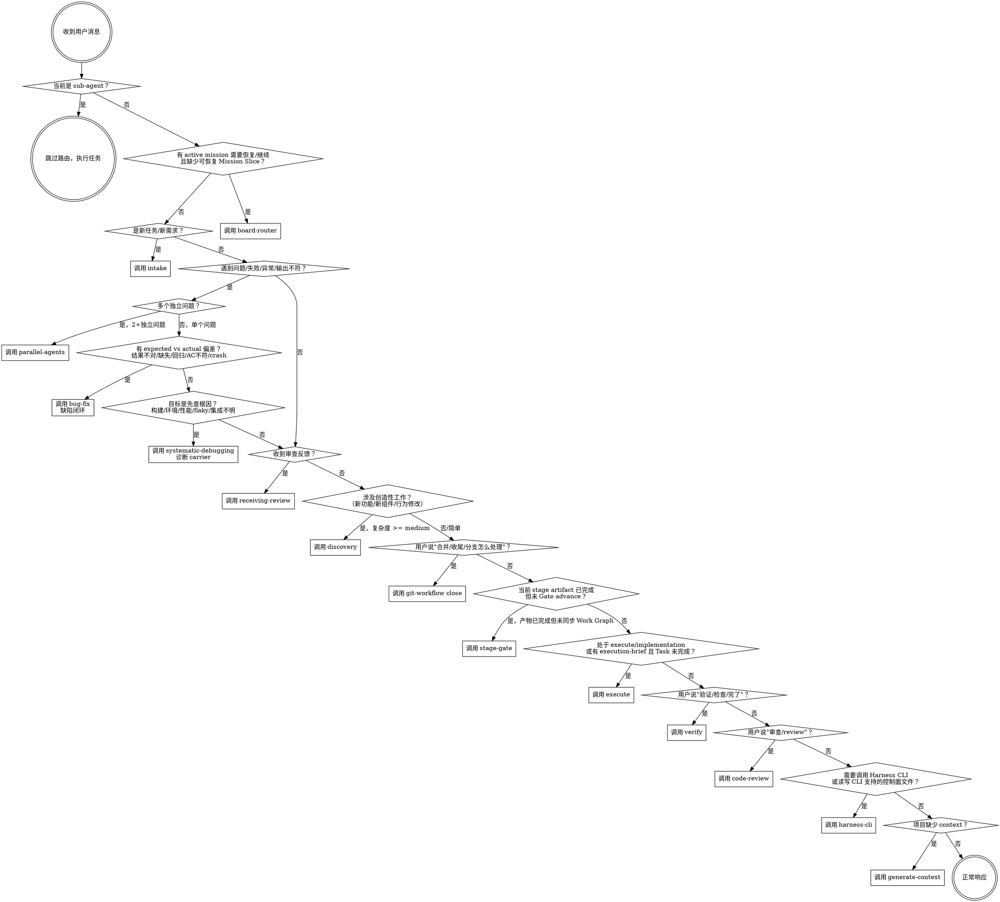

<SUBAGENT-STOP>
如果你是作为 sub-agent 被分派执行特定任务的，跳过此技能。
</SUBAGENT-STOP>

<EXTREMELY-IMPORTANT>
如果你认为哪怕只有 1% 的可能性某个技能适用于你正在做的事情，你必须调用该技能。
这不可协商。这不是可选的。你不能通过合理化来逃避。
</EXTREMELY-IMPORTANT>

# 技能路由

## 铁律

```
收到任何用户消息后，先检查 技能匹配，再做任何事。
```

## 决策流程



## 红线——停下来，你在合理化

| 想法 | 现实 |
|------|------|
| "这只是一个简单的问题" | 问题也是任务。检查技能。 |
| "我需要先了解更多上下文" | 技能检查在澄清问题之前。 |
| "让我先探索一下代码库" | 技能告诉你如何探索。先检查。 |
| "这不需要正式的技能" | 如果技能存在，就使用它。 |
| "我记得这个技能的内容" | 技能会迭代更新。阅读当前版本。 |
| "这不算一个任务" | 行动 = 任务。检查技能。 |
| "技能太小题大做了" | 简单的事会变复杂。使用它。 |
| "让我先做这一件事" | 在做任何事之前先检查。 |
| "我知道那是什么意思" | 知道概念 ≠ 使用技能。调用它。 |

## 宣布正在使用

调用任何技能前必须宣布：`"使用 [技能名称] 来 [目的]。"`

> 宣布是强制的，不是可选的。透明性让用户知道 AI 在做什么，也防止 AI 在不知不觉中跳过技能。

## 技能优先级

当多个技能可能适用时：

1. **治理技能最优先**（任务接入、Stage Gate、中途纠偏）— 决定做什么
2. **流程技能其次**（探索、systematic-debugging、parallel-agents）— 决定怎么做
3. **执行技能再次**（执行、code-review、receiving-review）— 执行（git-workflow 由自治循环全程管理，不经skill-router 调度）
4. **工具技能按需**（query-api-docs、ui-ux-pro-max、gitnexus-*、harness-cli）— 随时可调用，不依赖阶段
5. **辅助技能最后**（执行日志、Harness 自检、writing-plans）— 记录和检查

缺陷 / 质量协议使用下方专门路由表判定，不受上述通用排序覆盖。只要输入已经描述 expected vs actual 偏差，优先 `bug-fix`，不得因为 `systematic-debugging` 是流程技能而跳过缺陷闭环。

## 工具技能触发条件

以下技能在任意阶段均可独立触发，不进入完整工作流：

| 触发信号 | 技能 |
|---------|-------|
| 查接口文档 / 查 API / 看接口 / YAPI / 接口对接 / "XX 接口怎么定义的" | `query-api-docs` |
| 做界面 / UI / UX / 落地页 / Dashboard / 移动端界面 / 设计系统 / 配色字体 / 组件样式 / Tailwind shadcn / 可访问性改版 | `ui-ux-pro-max` |
| 可视化交互设计 / 线框图 / 原型 / mockup / 设计变体 / 交互预览 | `visual-interaction-design` |
| 项目分析 / 代码库分析 / 架构理解 / 代码怎么工作 / 调用链 / 执行流 / 陌生代码库 / "先看下项目" | `gitnexus-exploring` |
| 影响分析 / blast radius / 会不会影响 / 谁依赖它 / 改 X 会不会炸 / 安全改动评估 | `gitnexus-impact-analysis` |
| GitNexus 索引 / 重新分析仓库 / index stale / 生成 wiki / 查看 GitNexus 状态 | `gitnexus-cli` |
| 有 active mission 需要恢复、用户说“继续”、会话恢复、当前 Mission Slice 缺失或已完成、需要从 Board 选择下一项工作 / "从看板继续" / "推进下一个 node" / "恢复 Board" | `board-router` |
| 明确要求重建 Work Graph 索引 / 检查 Work Graph 一致性 / 修复 board-index-tree 视图漂移 | `work-graph` |
| 调用 Harness CLI / 运行 `harness ...` / 读取或修改 CLI 支持的 Harness 控制面文件 / Gate run/advance / Board select / Work Graph graph apply/rebuild/check / Contract check/patch / Evidence command/graph/visual / Mission Slice / Approval / Frame / Project lint CLI | `harness-cli` |
| 当前 Mission Slice / Work Graph lane action 声明 `control_plane.stage=execute`，或 `lane_action.skill=execute` | `execute` |
| 当前 Mission Slice 声明 `control_plane.stage=solution`，或 `lane_action.skill=solution`，或用户说"做方案 / 路线选型 / 决策 / tradeoff" | `solution` |
| 当前 Mission Slice 声明 `control_plane.stage=interaction` 且 `harness config snapshot` 的 `prototype.delivery_mode=interactive_prototype`（默认），或 `lane_action.skill=interaction`，或 `harness interaction check-ui-trigger` 返回 requires_interaction=true | `interaction` |
| 当前 Mission Slice 声明 `control_plane.stage=interaction` 且 `harness config snapshot` 的 `prototype.delivery_mode=frontend_engineering`，或 `lane_action.skill=prototype-as-frontend`，或用户说"做原型即前端 / 把前端工程搭起来 / 用 MSW mock 起来" | `prototype-as-frontend` |
| 当前 Mission Slice 声明 `control_plane.stage=technical_analysis`，或 `lane_action.skill=technical_analysis`，或用户说"做技术设计 / 模块拆分 / interface_changes / 数据迁移设计" | `technical_analysis` |
| 用户说"设计一下 / 怎么实现 / 技术方案"但尚未确定具体 stage — 先调度 design SKILL.md 入口指引按 lane/stage 选择 interaction / solution / technical_analysis 之一 | `design`（routing-only entry） |
| breakdown 尚未为每个 Parent task 产出已审查的 parent-local `atomic_task_queue` | `breakdown`；必要时在写盘前内部使用 `writing-plans`，不得作为 breakdown 后补丁 |
| 用户要求开始执行，但 breakdown 的 `execution-brief.md`（含必需的 Atomic Task Queue）尚未通过 Stage Gate / `harness gate advance` 同步为 TASK node | `stage-gate` |

## CLI-first 恢复与状态路由

对以下场景，skill-router 先叠加 `harness-cli` 的只读 control 查询，再决定阶段技能：

| scenario | control 查询 | 后续路由 |
|----------|--------------|----------|
| `continue` | `harness control status` → `harness control candidates --intent continue` → 显式 mission 后 `harness control frame --mission` / `harness control guidance --mission` / `harness control context-index --mission` | 依据 frame/guidance 从 `lane_action.skill` 派生的 dispatch skill 调度，例如 `execute`、`board-router`、`stage-gate` |
| `status` | `harness control status`；需要单个任务时再查 `harness control frame --mission` | 汇总状态，不推进写操作 |
| `review` | status/candidates 后读取 frame/guidance/context-index | 调度 `code-review` 或当前 Mission 声明的 review skill |
| `verify` | status/candidates 后读取 frame/guidance/context-index | 调度 `verify` 或返回缺失 artifact / review / gate 控制 |
| `bug_report` | status/candidates 后读取 frame/guidance/context-index，确认是否属于当前 Mission | 调度 `bug-fix`，必要时发起 Decision Gate |
| `new_task` | 先用 `harness control status` 和 `harness control candidates --intent continue` 检查是否有应恢复任务 | 无应恢复候选或用户明确新开时调度 `intake` |

如果 control 查询不可用而 workflow 临时读取旧 runtime 文件，必须记录 `fallback_used`、`fallback_reason`、`legacy_source`、`follow_up`。`control.candidates` 只提供候选事实，调用方不得把 candidates 当作最终选择。

## 缺陷 / 质量协议路由

先读取 `.harness/common/protocols/README.md`。在 dedicated 技能可用时，优先进入 dedicated 技能；既有技能作为内部 carrier 使用。

### `bug-fix` vs `systematic-debugging`

| 判定问题 | 进入 `bug-fix` | 进入 `systematic-debugging` |
|----------|----------------|-----------------------------|
| 用户是否描述了 expected vs actual 偏差？ | 是。结果不对、输出缺失、样式丢失、行为回归、AC 不符、线上异常、crash | 否。只是要查原因、定位链路或理解失败机制 |
| 是否需要缺陷闭环？ | 是。必须有复现证据、根因、最小修复、回归验证、Harness 缺口 decision | 否或尚未确认。只做观察、分析、假设验证；确认行为缺陷后切换到 `bug-fix` |
| 是否允许直接 patch？ | 只有复现证据或 blocked 复现记录后才允许，由 `bug-fix` 编排 | standalone 诊断可在 Phase 4 修复；作为 `bug-fix` carrier 时不得 patch |
| 典型表达 | "某个输出产物缺失了预期内容或样式" | "先查为什么某个任务偶发卡住，暂时不要改代码" |

| 输入 / 信号 | Primary route | 协议 reference | 说明 |
|-------------|---------------|--------------------|------|
| 用户报告结果不对、内容/样式缺失、输出与模板/规格不符、回归、线上异常、失败复现 | `bug-fix` | `bug-fix` | 先复现和定位根因；需要改代码时再进入 `execute` |
| 用户要求先查原因、定位根因、暂不修复，且未描述明确 expected vs actual 偏差 | `systematic-debugging` | — | 只做诊断；若确认行为缺陷，切换到 `bug-fix` |
| 构建/编译/环境/性能/flaky/集成链路问题，根因未知且未表现为产品行为缺陷 | `systematic-debugging` | — | 用 4 阶段调试法收集证据和验证假设 |
| `execute` 中出现缺陷类失败 | 当前 `execute` 工作流内引用 `bug-fix` | `bug-fix` | 程序化复现 / 回归命令 + AI 根因 / minimal fix |
| `verify` 中 AC fail 且根因未知 | `bug-fix` | `bug-fix` | 验证标注失败证据，程序化重跑，AI 定位根因 |
| `verify` 中 AC fail 且根因已确认 | `execute` + `bug-fix` | `bug-fix` | 修复必须引用验证 evidence、复现命令和 root cause |
| 用户要求代码质量评估、架构/正确性/安全审查 | `quality-control` | `quality-control` | 程序化命令证据 + 审查员 finding + evidence classification |
| 用户要求阶段性验收、AC 证据充分性 | `quality-control` | `quality-control` | 程序化检查 AC / evidence / 阻塞 reason，AI 判断证据充分性 |
| 用户要求完成前最终确认 | `verification-before-completion` + `quality-control` | `quality-control` | 交付前证据检查 |
| 模板、规则、工作流自洽性检查 | `harness-lint` + `quality-control` | `quality-control` | Harness runtime assets 结构一致性 |
| 目标项目约束、变更范围、命令证据或执行轨迹检查 | `project-lint` + `quality-control` | `project-lint` | 业务项目代码和 Agent 轨迹的确定性约束 |
| Stage Gate evidence 缺口 | 当前 `stage-gate` 工作流暂停并引用 `quality-control` | `quality-control` | checker 给出 FAIL / WARN，AI 分类缺口 |
| 审查员 HOLD | 当前审查工作流暂停并引用 `quality-control` | `quality-control` | HOLD 转为可修复 finding 或 accepted risk |

若同一输入同时命中缺陷和 quality，优先 `bug-fix`，因为质量结论必须建立在复现、根因或证据状态之上。

<HARD-GATE>
在棕地项目中，只要进入探索的"当前现状/现有代码/架构理解"分析，若 `gitnexus-exploring` 技能可用，就必须把它作为探索的辅助技能；不能只用 grep/文件列表替代。GitNexus 不可用（未安装、索引缺失或过期）时，必须在 discovery 阶段 evidence carrier 的 `degradations[]` 中结构化记录降级原因和补救动作，不允许只在 markdown 末尾 prose 描述。
</HARD-GATE>

## 技能类型

| 类型 | 示例 | 遵循方式 |
|------|------|---------|
| **刚性**（纪律执行） | 执行、验证、code-review | 严格遵循，不偏离 |
| **柔性**（流程引导） | 探索、prd、设计 | 根据上下文调整 |
| **自动**（后台运行） | 执行日志、Stage Gate | 由自治循环集成 |
| **内部步骤** | execute dispatch plan | 不作为用户请求的 primary route；只能由所属阶段 workflow 使用 |

## 内部 carrier 边界

| 内部步骤 | 只能由谁使用 | 不直接触发的用户表达 |
|-------|--------------|----------------------|
| `execute/dispatch-plan.md` | `execute/workflow.md` 在处理单个 Atomic Task 时使用 | "执行"、"实现"、"安排专家"、"调度执行专家"；这些表达应先路由到 `execute` |
| `work-graph` | `board-router`、`stage-gate`、`harness-lint`，或用户明确要求 Work Graph 修复/重建/一致性检查 | "新需求"、"继续任务"、"推进阶段"；这些表达应先路由到 `intake`、自治循环或 `board-router` |

## 与自治循环的关系

skill-router 是自治循环的**补充**，不是替代：
- **自治循环** 负责阶段推进和状态管理
- **skill-router** 负责每轮对话的技能匹配和调度

两者同时运行。自治循环的阶段判断优先级高于skill-router 的症状匹配。

按 `workflow.md` 执行详细路由逻辑。
